**Lift&Shift Application Workflow to AWS**

[_Project Source_](https://www.udemy.com/course/devopsprojects/?src=sac&kw=devops+projects)

## Prerequisites:

- AWS Account
- Registered DNS Name
- Maven
- JDK8
- AWS CLI

##### Architecture on AWS:

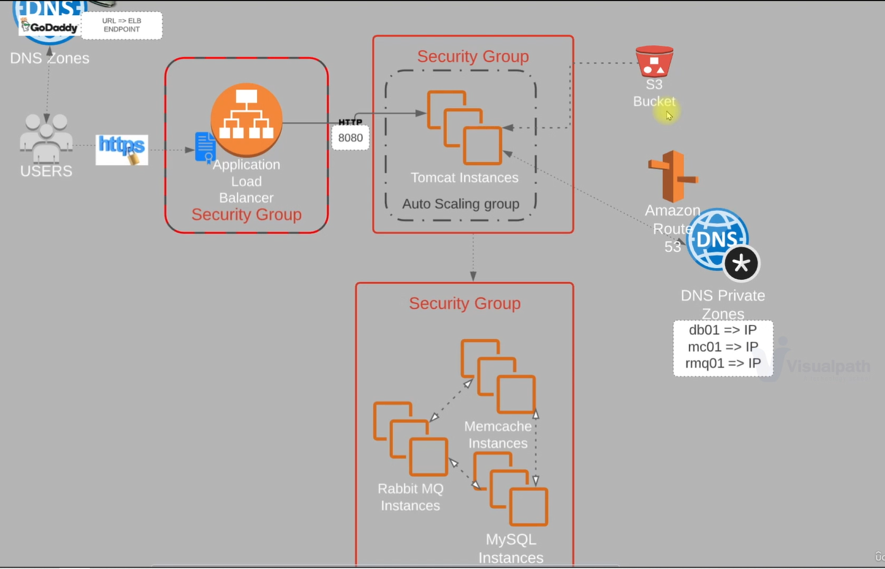

**Lift&Shift Application Workflow to AWS Steps**

1. Create Security groups
2. Create Key pairs
3. Launch instance with user data(Bash scripts)
4. Update ip to name mapping in route 53
5. Build Application from source code
6. Upload to S3 bucket
7. Download artifact to Tomcat ec2 instance
8. Setup ELB with HTTPS
9. Map ELB endpoint to website name to domain name
10. Verify

### Step-1: Create Security Groups for Services

- We will create `vprofile-ELB-SG` first. We will configure `Inbound` rules to Allow both `HTTP` and `HTTPS` on port `80` and `443` respectively from Anywhere `IPv4` and `IPv6`.

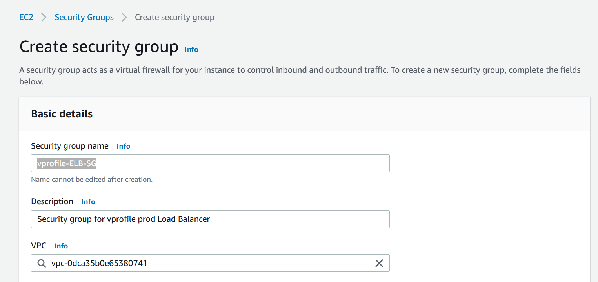
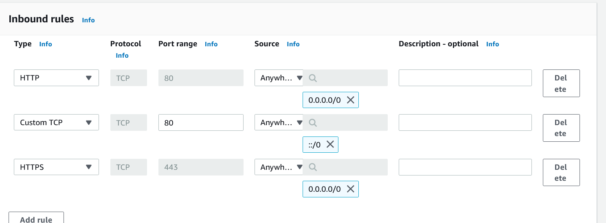

- Next we will create `vprofile-app-SG`. We will open port `8080` to accept connections from `vprofile-ELb-SG`.
  

Finally, we will create `vprofile-backend-SG`. WE need to open port `3306` for `MySQL`, `11211` for `Memcached` and `5672` for `RabbitMQ` server. We can check whcih ports needed fro aplication services to communicate each other from `application.properties` file under `src/main/resources` directory.We also need to open commucation `AllTraffic` from own SecGrp for backend services to communicate with each other.

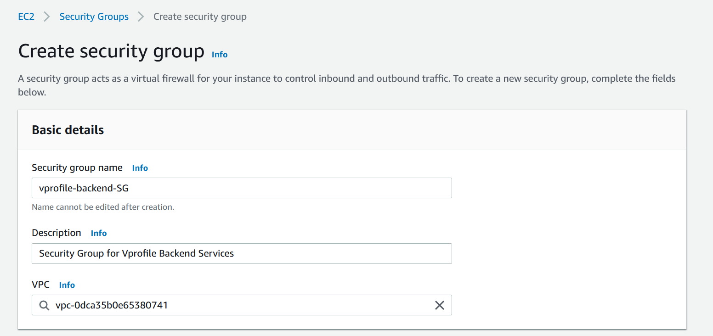

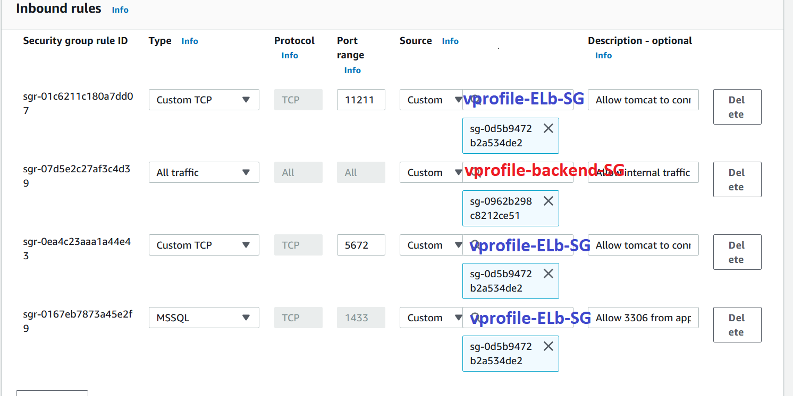

### Step-2: Create KeyPair to Connect EC2 instances

- We will create a Keypair to connect our instances via SSH.
  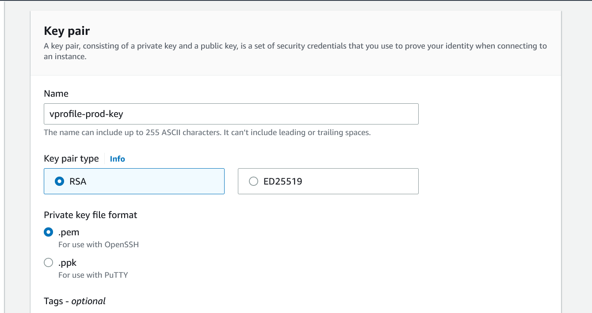

### Step-3: Launch Backend EC2 instances with UserData script

##### DB Instance:

- Create DB instance with below details.We will also add Inbound rule to `vprofile-backend-SG` for `SSH` on port `22` from `MyIP` to be able to connect our db instance via SSH.

```sh
Name: vprofile-db01
Project: vprofile
AMI: Centos 7
InstanceType: t2.micro
SecGrp: vprofile-backend-SG
UserData: mysql.sh
```

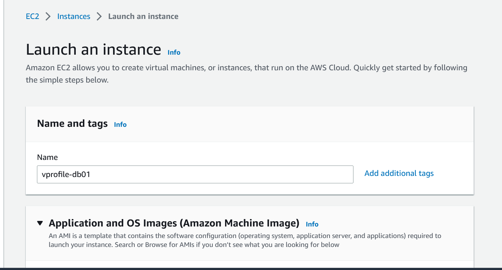


- Once our instance is ready, we can SSH into the server and check if userdata script is executed.We can also check status of mariadb.

```sh
ssh -i vprofile-prod-key.pem centos@<public_ip_of_instance>
sudo su -
curl http://169.254.166.244/latest/user-data
systemctl status mariadb
```

##### Memcached Instance:

- Create Memcached instance with below details.

```sh
Name: vprofile-mc01
Project: vprofile
AMI: Centos 7
InstanceType: t2.micro
SecGrp: vprofile-backend-SG
UserData: memcache.sh
```

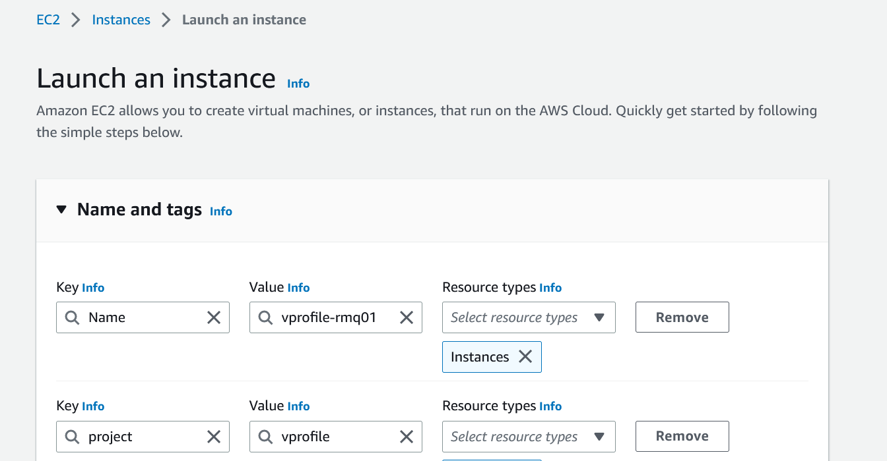
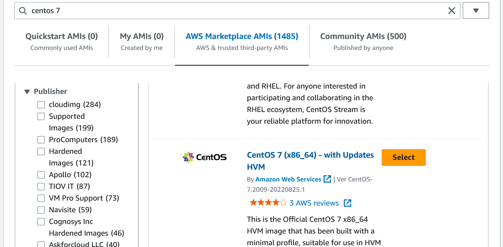
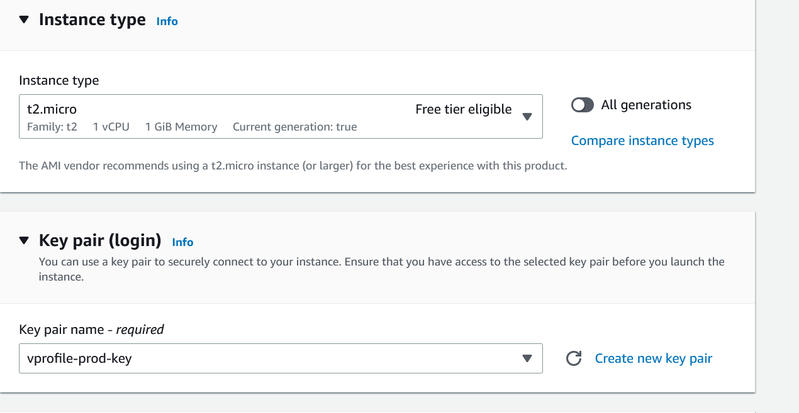


- Once our instance is ready, we can SSH into the server and check if userdata script is executed.We can also check status of memcache service and if it is listening on port 11211.

```sh
ssh -i vprofile-prod-key.pem centos@<public_ip_of_instance>
sudo su -
curl http://169.254.169.254/latest/user-data
systemctl status memcached.service
ss -tunpl | grep 11211
```

##### RabbitMQ Instance:

- Create RabbitMQ instance with below details.

```sh
Name: vprofile-rmq01
Project: vprofile
AMI: Centos 7
InstanceType: t2.micro
SecGrp: vprofile-backend-SG
UserData: rabbitmq.sh
```


- Once our instance is ready, we can SSH into the server and check if userdata script is executed.We can also check status of rabbitmq service.

```sh
ssh -i vprofile-prod-key.pem centos@<public_ip_of_instance>
sudo su -
curl http://169.254.169.254/latest/user-data
systemctl status rabbitmq-server
```

### Step-4: Create Private Hosted Zone in Route53

- Our backend stack is running. Next we will update Private IP of our backend services in Route53 Private DNS Zone.Lets note down Private IP addresses.

```sh
db01 172.31.80.249
mc01 172.31.88.134
rmq01 172.31.89.37
```

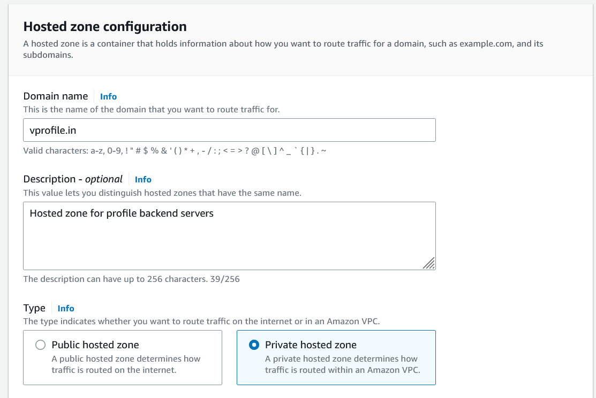

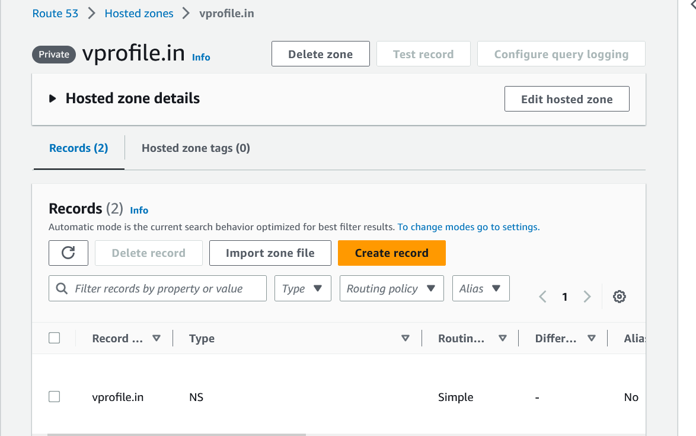


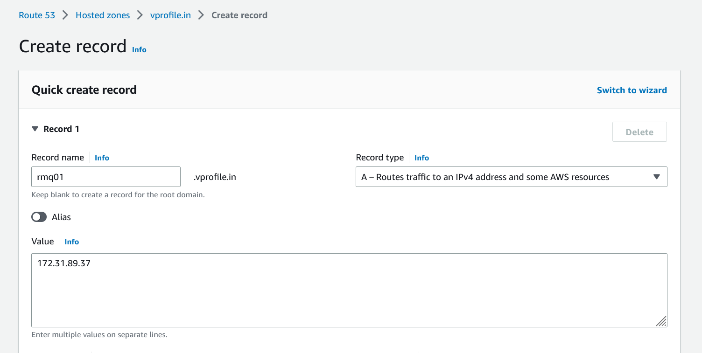

### Step-5: Build Application from source code

- Create Tomcat instance with below details.We will also add Inbound rule to `vprofile-app-SG` for `SSH` on port `22` from `MyIP` to be able to connect our db instance via SSH.

```sh
Name: vprofile-app01
Project: vprofile
AMI: Ubuntu 18.04
InstanceType: t2.micro
SecGrp: vprofile-app-SG
UserData: tomcat_ubuntu.sh
```

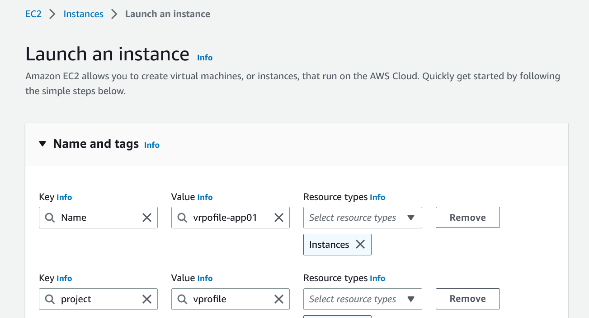
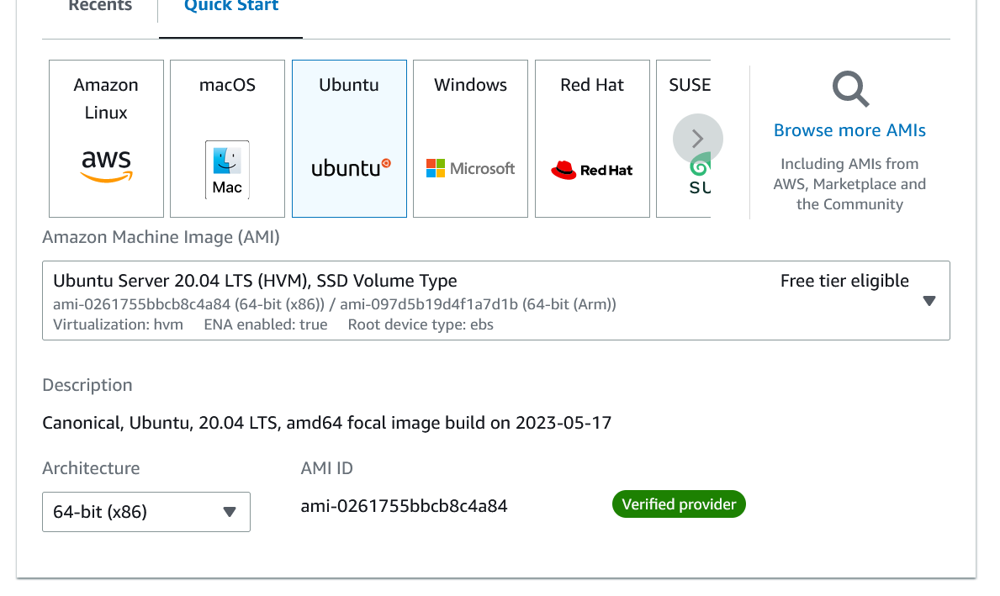
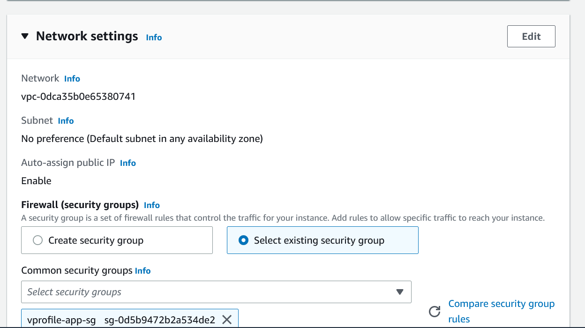

### Step-6: Create Artifact Locally with MAVEN

- Clone the repository.

```sh
git clone https://github.com/volkan4242/vprofile-project.git
```

- Before we create our artifact, we need to do changes to our `application.properties` file under `/src/main/resources` directory for below lines.

```sh
jdbc.url=jdbc:mysql://db01.vprofile.in:3306/accounts?useUnicode=true&

memcached.active.host=mc01.vprofile.in

rabbitmq.address=rmq01.vprofile.in
```


- We will go to `vprofile-project` root directory to the same level pom.xml exists. Then we will execute below command to create our artifact `vprofile-v2.war`:

```sh
mvn install
```

### Step-7: Create S3 bucket using AWS CLI, copy artifact

- We will upload our artifact to s3 bucket from AWS CLI and our Tomcat server will get the same artifact from s3 bucket.

- We will create an IAM user for authentication to be used from AWS CLI.

```sh
name: vprofile-s3-admin
Access key - Programmatic access
Policy: s3FullAccess
```

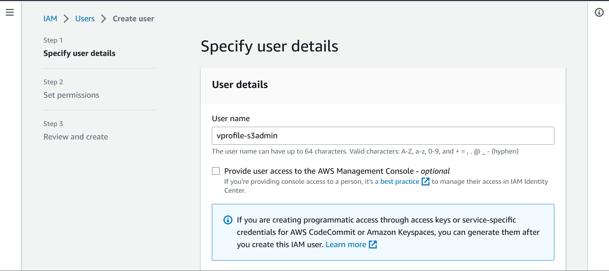

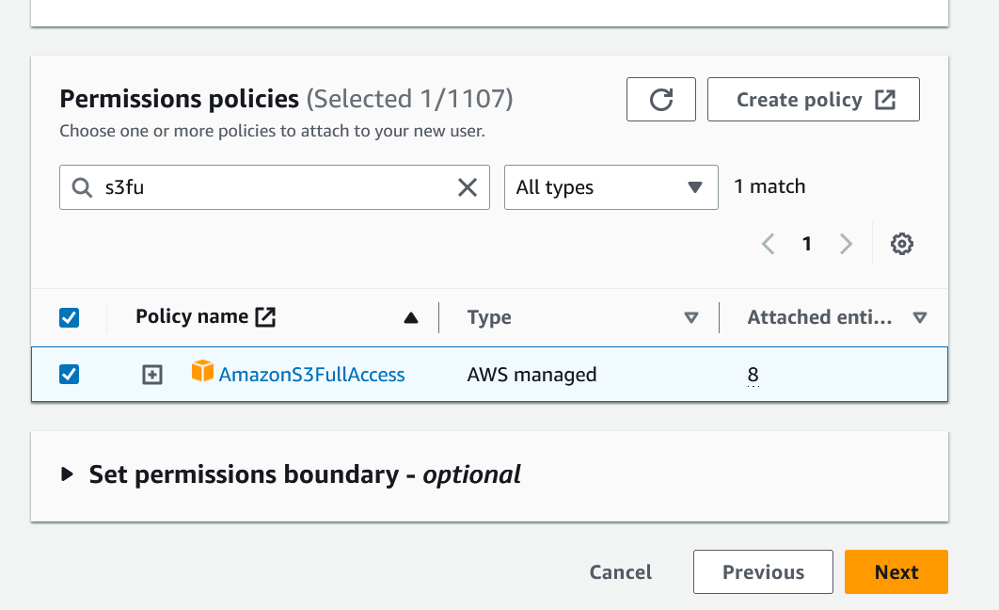

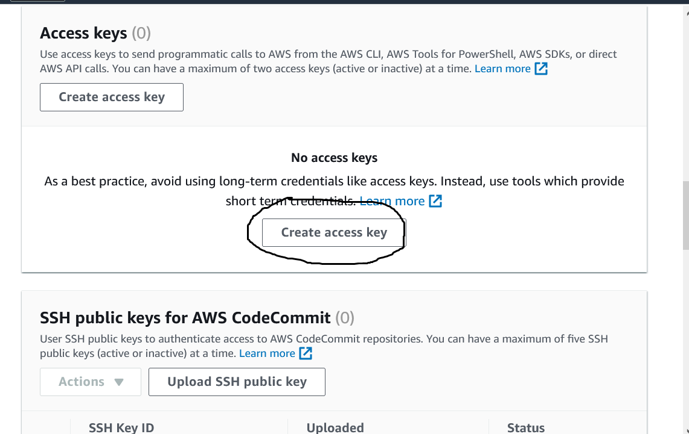
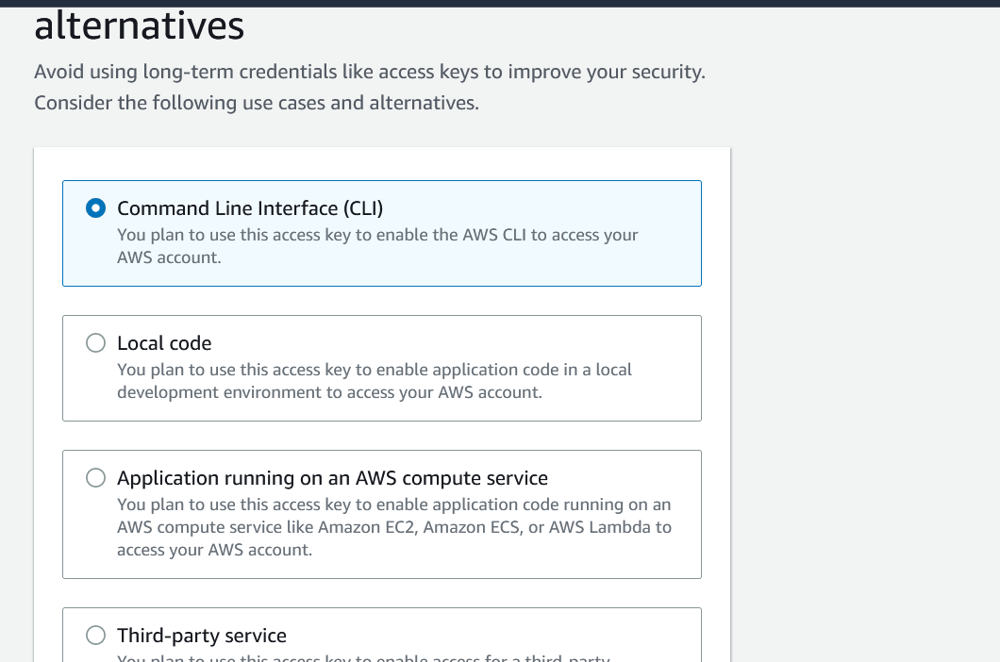

- Next we will configure our `aws cli` to use iam user credentials.

```sh
aws configure
AccessKeyID:
SecretAccessKey:
region: us-east-1
format: json
```

- Create bucket. Note: S3 buckets are global so the naming must be UNIQUE!

```sh
aws s3 mb s3://vprofile-artifact-storage-tr
```

- Go to target directory and copy the artifact to bucket with below command. Then verify by listing objects in the bucket.

```sh
aws s3 cp vprofile-v2.war s3://vprofile-artifact-storage-tr
aws s3 ls vprofile-artifact-storage-tr
```

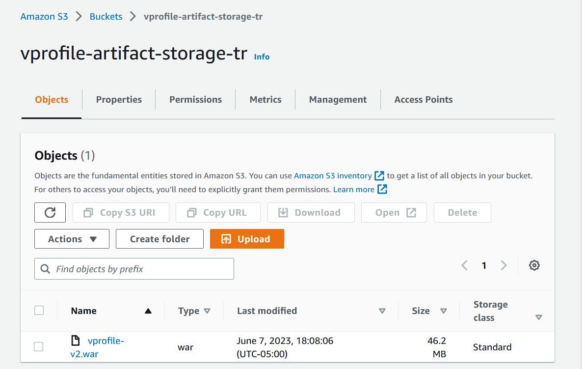

### Step-8: Download Artifact to Tomcat server from S3

- In order to download our artifact onto Tomcat server, we need to create IAM role for Tomcat. Once role is created we will attach it to our `app01` server.

```sh
Type: EC2
Name: vprofile-artifact-storage-role
Policy: s3FullAccess
```


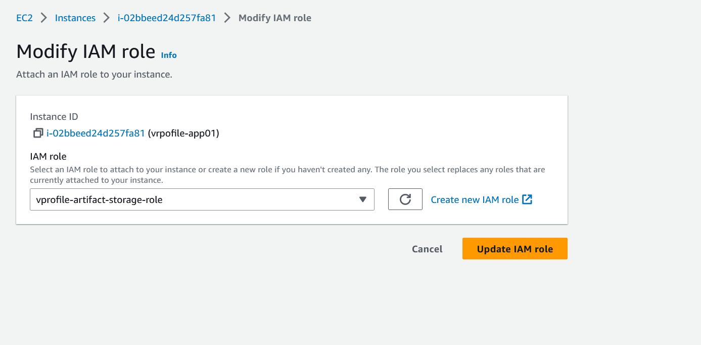

- Before we login to our server, we need to add SSH access on port 22 to our `vprofile-app-SG`.

- Then connect to `app011` Ubuntu server.

```sh
ssh -i "vprofile-prod-key.pem" ubuntu@<public_ip_of_server>
sudo su -
systemctl status tomcat9
```

- We will delete `ROOT` (where default tomcat app files stored) directory under `/var/lib/tomcat9/webapps/`. Before deleting it we need to stop Tomcat server.

```sh
cd /var/lib/tomcat9/webapps/
systemctl stop tomcat9
rm -rf ROOT
```

- Next we will download our artifact from s3 using aws cli commands. First we need to install `aws cli`. We will initially download our artifact to `/tmp` directory, then we will copy it under `/var/lib/tomcat9/webapps/` directory as `ROOT.war`. Since this is the default app directory, Tomcat will extract the compressed file.

```sh
apt install awscli -y
aws s3 ls s3://vprofile-artifact-storage-tr
aws s3 cp s3://vprofile-artifact-storage-tr/vprofile-v2.war /tmp/vprofile-v2.war
cd /tmp
cp vprofile-v2.war /var/lib/tomcat9/webapps/ROOT.war
systemctl start tomcat9
```

- We can also verify `application.properties` file has the latest changes.

```sh
cat /var/lib/tomcat8/webapps/ROOT/WEB-INF/classes/application.properties
```

- We can validate network connectivity from server using `telnet`.

```sh
apt install telnet
telnet db01.vprofile.in 3306
```


### Step-9: Setup LoadBalancer

- Before creating LoadBalancer , first we need to create Target Group.

```sh
Intances
Target Grp Name: vprofile-elb-TG
protocol-port: HTTP:8080
healtcheck path : /login
Advanced health check settings
Override: 8080
Healthy threshold: 3
available instance: app01 (Include as pending below)
```


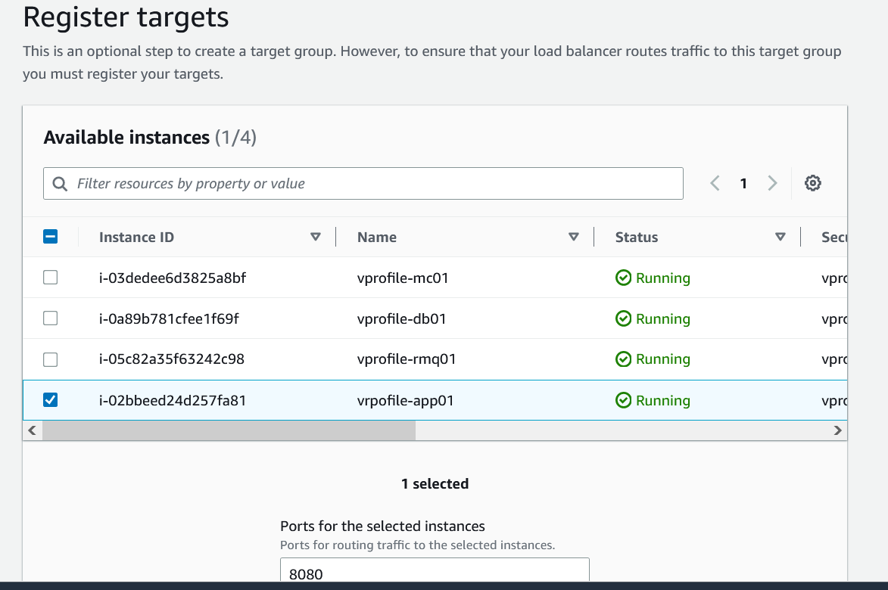

- Now we will create our Load Balancer.

```sh
vprofile-prod-elb
Internet Facing
Select all AZs
SecGrp: vprofile-elb-secGrp
Listeners: HTTP, HTTPS
Select the certificate for HTTPS
```

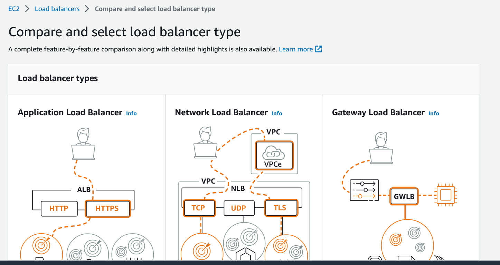
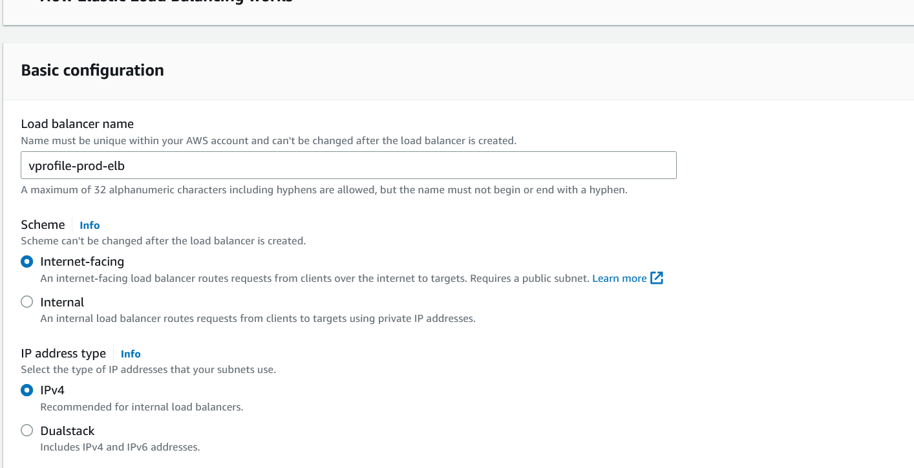
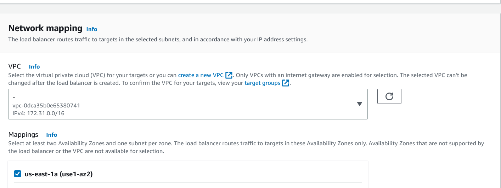


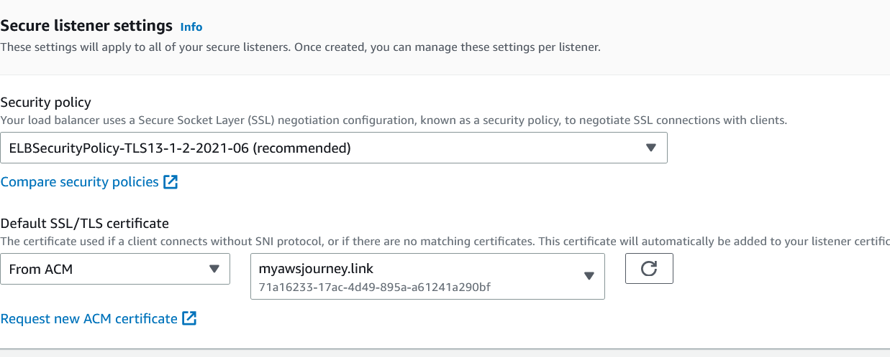

### Step-10: Create Route53 record for ELB endpoint

- We will create an A record with alias to ALB so that we can use our domain name to reach our application.

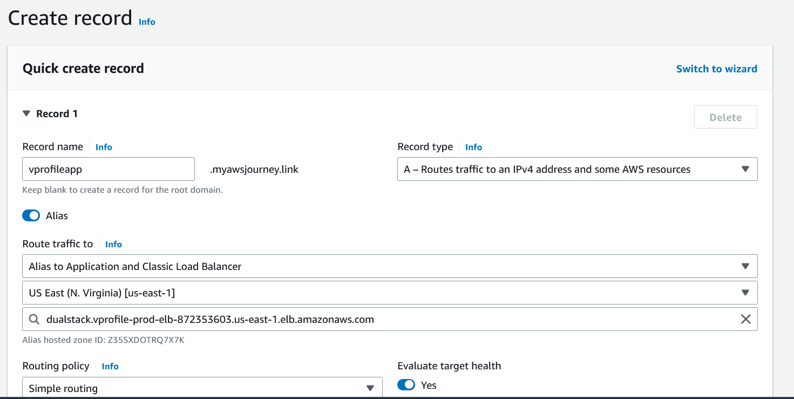

- Lets check our application using our DNS. We can securely connect to our application!


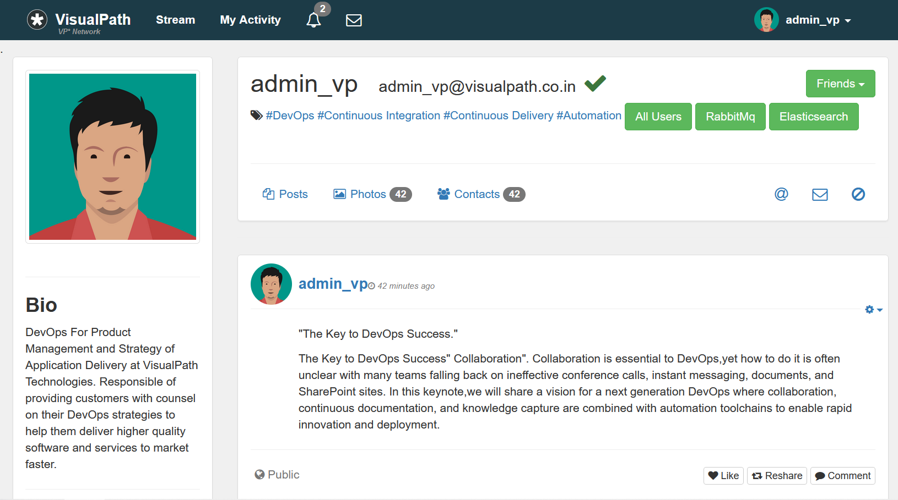
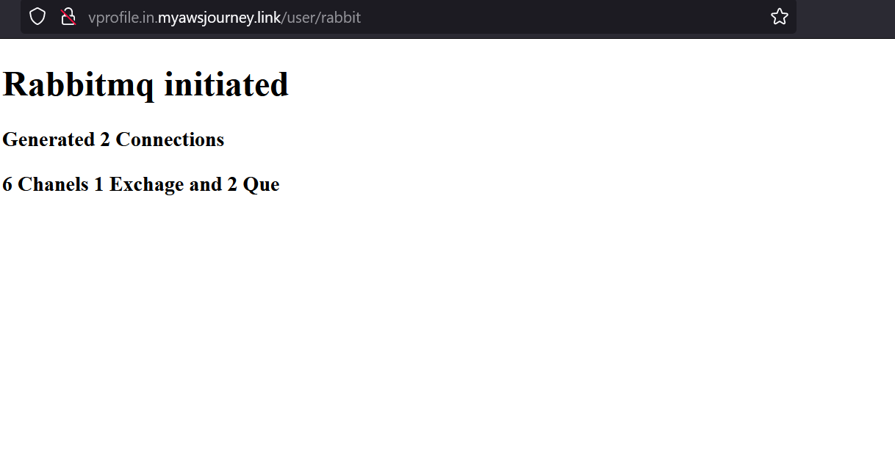


### Step-11: Configure AutoScaling Group for Application Instances

- We will create an AMI from our App Instance.

- Next we will create a Launch template using the AMI created in above step for our ASG.

```sh
Name: vprofile-app-LT
AMI: vprofile-app-image
InstanceType: t2.micro
IAM Profile: vprofile-artifact-storage-role
SecGrp: vprofile-app-SG
KeyPair: vprofile-prod-key
```


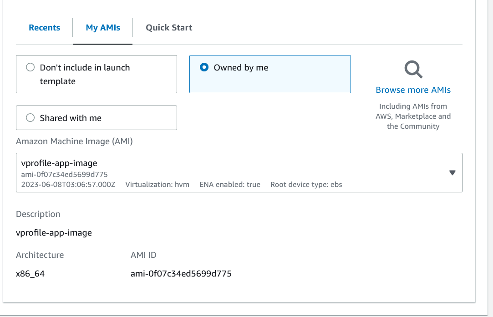


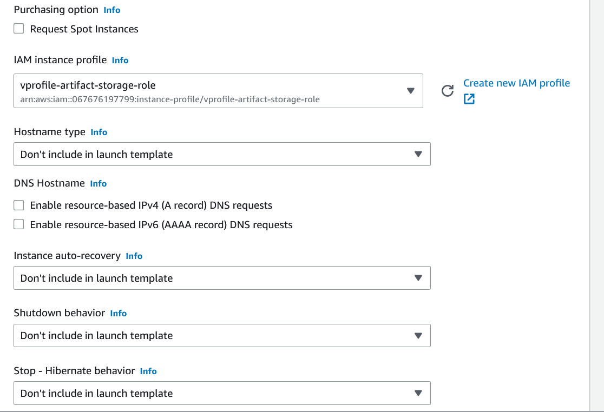

- Our Launch template is ready, now we can create our ASG.

```sh
Name: vprofile-app-ASG
ELB healthcheck
Add ELB
Min:1
Desired:2
Max:4
Target Tracking-CPU Utilization 50
```

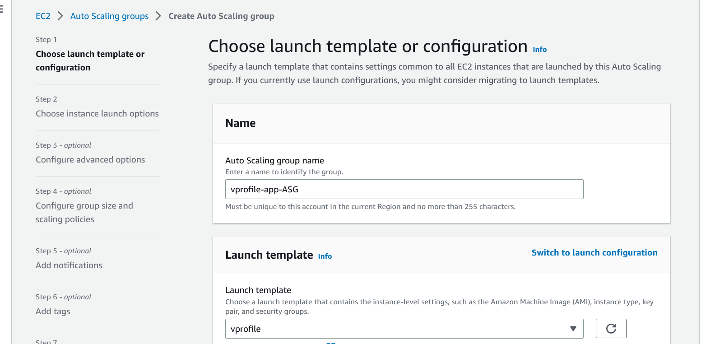


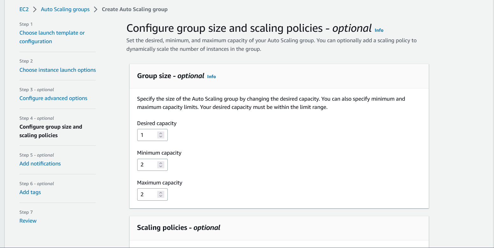
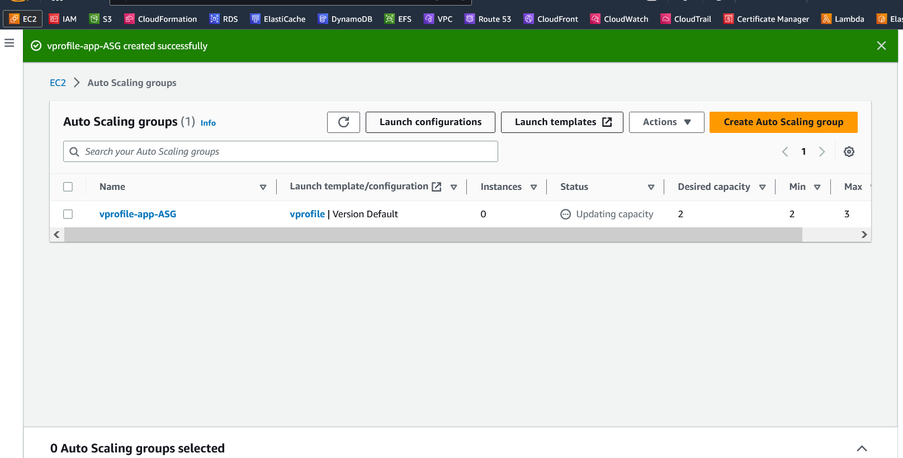

- If we terminate any instances we will see ASG will create a new one using LT that we created.

### Step-12: Clean-up

- Delete all resources we created to avoid any charges from AWS.
