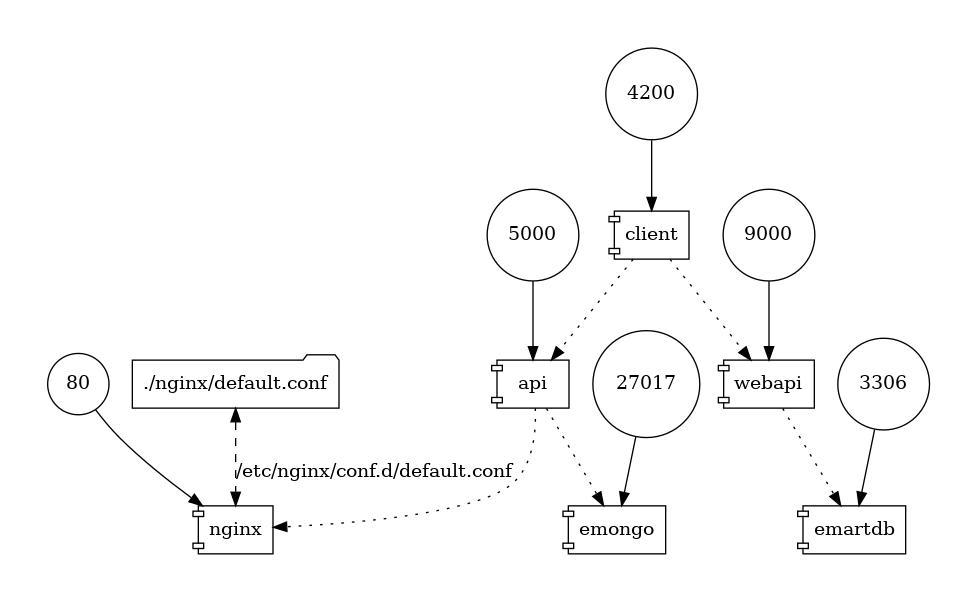
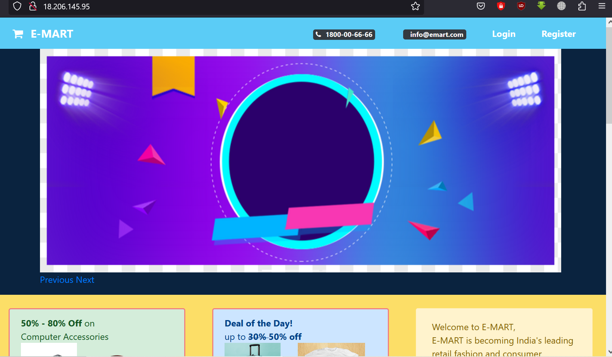
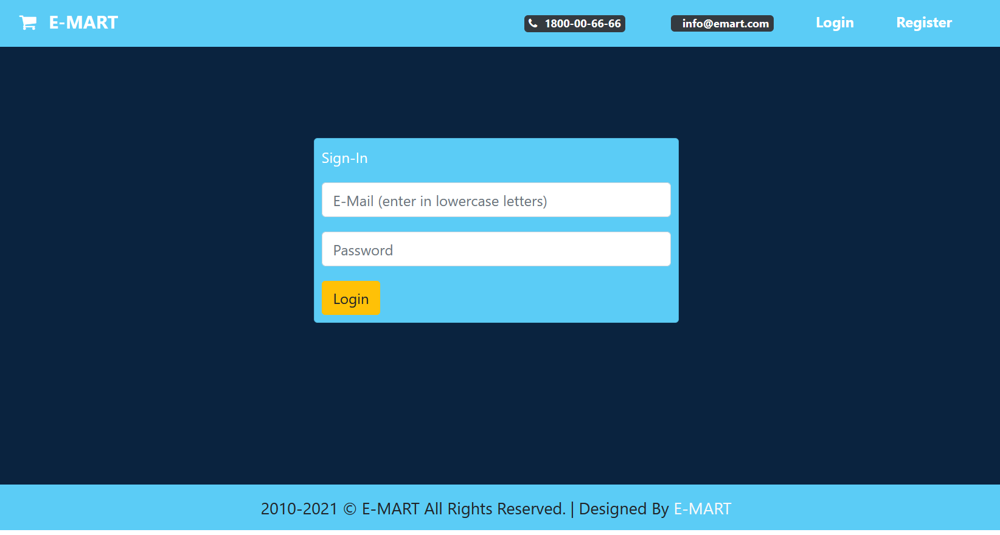

**Dockerized Multi-Service Application**



This repository contains a dockerized multi-service application designed for modularity, scalability, and ease of deployment. The system integrates a web client, two distinct APIs (Node.js and Java), and is backed by MongoDB and MySQL databases. An NGINX reverse proxy handles incoming requests efficiently.

**Components:**

**Web Client:** A frontend interface for users, built from the ./client directory. \***\*Node.js API: \*\***Backend service developed in Node.js, sourced from the ./nodeapi directory.
**Java Web API:** Another backend service developed in Java, originating from the ./javaapi directory.
**MongoDB:** Flexible NoSQL database, initialized with the epoc database. \***\*MySQL: \*\***Structured relational database, initialized with the books database.
** NGINX:**Reverse proxy for managing and directing incoming traffic.

**Prerequisites:**

Docker
Docker Compose

**Setup:**

For this project we will create Lets create an EC2 instance with below details:

```sh
AMI: Ubuntu 20.04
Instance Type: t2.micro
SecGrp: allow SSH on port 22
Create a new keypair
UserData:

#!/bin/bash
# Install docker
apt-get update
apt-get install -y apt-transport-https ca-certificates curl software-properties-common
curl -fsSL https://download.docker.com/linux/ubuntu/gpg | sudo apt-key add -
add-apt-repository \
   "deb [arch=amd64] https://download.docker.com/linux/ubuntu \
   $(lsb_release -cs) \
   stable"
apt-get update
apt-get install -y docker-ce
usermod -aG docker ubuntu

# Install docker-compose
curl -L https://github.com/docker/compose/releases/download/1.21.0/docker-compose-$(uname -s)-$(uname -m) -o /usr/local/bin/docker-compose
chmod +x /usr/local/bin/docker-compose

```

1. Clone the Repository:

git clone https://github.com/devopshydclub/emartapp.git

2. Build and Start the Services:

docker-compose build then docker-compose up

3. Stop and Remove Services:

docker-compose down




