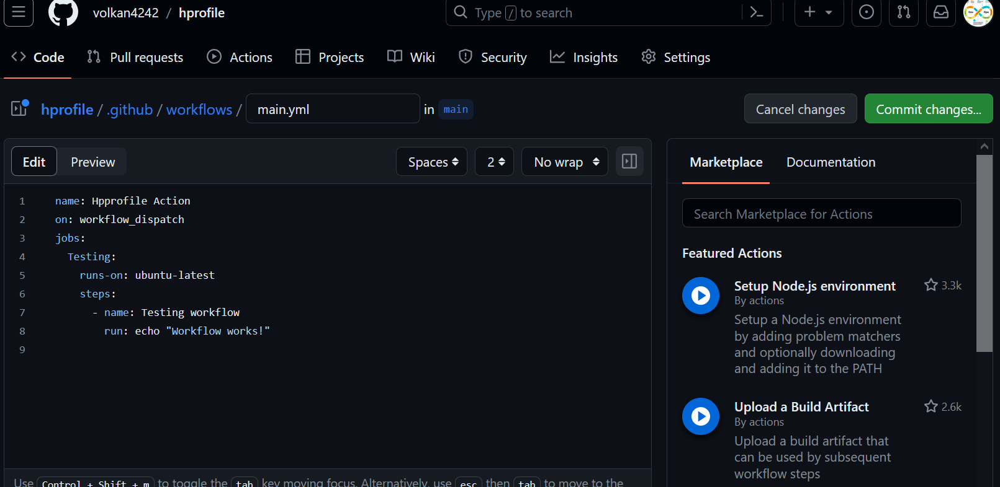
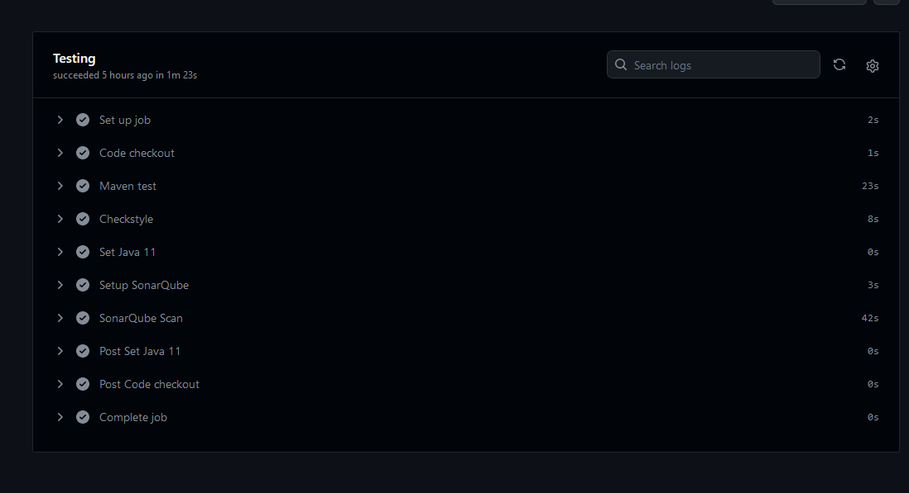

# Hprofile Actions - CI/CD with GitHub Actions and AWS

[_Project Source_](https://www.udemy.com/course/devopsprojects/?src=sac&kw=devops+projects)

## Introduction

Welcome to the Hprofile Actions project! This project demonstrates a robust Continuous Integration and Continuous Deployment (CI/CD) pipeline using GitHub Actions within a GitOps framework. By integrating various tools and services, we deploy a comprehensive application on AWS, complete with database management and container orchestration.

## Project Overview

This project focuses on setting up a CI/CD pipeline using GitHub Actions. It incorporates testing, building Docker images, and deploying to Amazon Elastic Container Service (ECS) with a relational database managed by Amazon RDS. This is a step towards embracing GitOps, where all operational tasks are managed through code.

## Architecture

The project uses various tools and services for a fully automated pipeline:

- **GitHub**: Hosts the source code and GitHub Actions for CI/CD.
- **Maven**: Builds the application and runs tests.
- **SonarQube & SonarCloud**: Analyzes code quality and checks for technical debts.
- **Docker**: Packages the application into a Docker image.
- **AWS ECR (Elastic Container Registry)**: Stores Docker images.
- **AWS ECS (Elastic Container Service)**: Runs and manages Docker containers.
- **AWS RDS (Relational Database Service)**: Manages the database used by the application.
- **Load Balancers**: Exposes the ECS service to the internet.

The workflow consists of three main jobs: Testing, Building and Publishing the Docker image, and Deployment.

## Prerequisites

- An AWS account with the necessary permissions.
- A GitHub account.
- Basic understanding of Docker, AWS services, and GitHub Actions.

## Setup and Workflow

### 1. GitHub Repository Setup

- **Fork the Repository**: Fork the provided repository containing the source code into your GitHub account.
- **SSH Setup**: Configure SSH keys for secure access to your GitHub repository.
- **VS Code Integration**: Integrate the repository with VS Code or your preferred IDE for easy code pushes and pulls.

### 2. Testing Job

- **Maven Tests**: Run unit tests and Checkstyle checks.
- **SonarQube Scan**: Analyze the source code with SonarQube and upload results to SonarCloud.
- **Quality Gate Check**: Ensure the code passes the defined quality gates.

### 3. AWS RDS Database Setup

- **Create an RDS Instance**: Set up an RDS instance on AWS. Choose the appropriate engine (e.g., MySQL, PostgreSQL) and configure the settings according to your application's needs.
- **Security and Access**: Ensure the RDS instance is securely configured, with the right security groups and access rules to allow communication from your ECS service.
- **Database Configuration**: Update the application's configuration files or environment variables to point to the new RDS instance, ensuring it can connect and interact with the database.

### 4. AWS ECS Cluster Creation

- **Create ECS Cluster**: Set up an ECS cluster on AWS. This will be the environment where your Docker containers will run.
- **Configure Networking**: Ensure the ECS cluster is correctly configured within your VPC, with the right subnets and security groups for secure and efficient operation.
- **Task Definitions**: Create an ECS task definition that describes your application container, including the Docker image to use, required resources, and configuration.

### 5. Build and Publish Job

- **Docker Image Build**: Use the source code to build a Docker image.
- **Push to AWS ECR**: Upload the built image to AWS Elastic Container Registry.

### 6. Deployment Job

- **Configure AWS Credentials**: Set up AWS credentials in GitHub Actions for deployment.
- **Update ECS Task Definition**: Use the new Docker image in the ECS task definition.
- **Deploy to ECS**: Update the ECS service with the new task definition to deploy the application.
- **Expose via Load Balancer**: Ensure the ECS service is exposed to the internet through a Load Balancer.

## Continuous Integration and Continuous Deployment

Each push to the repository triggers the CI/CD pipeline, which runs the tests, builds the Docker image, and deploys the application to AWS ECS. The entire process is automated, demonstrating the power of GitHub Actions in a GitOps workflow.

## Conclusion

This project provides a robust template for a CI/CD pipeline using GitHub Actions and AWS. By following through this project, you'll gain valuable skills in automation, containerization, cloud deployment, and database management.

---
