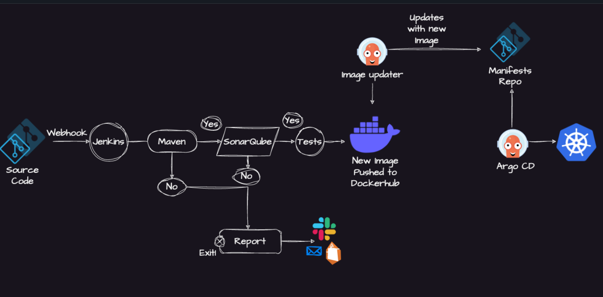
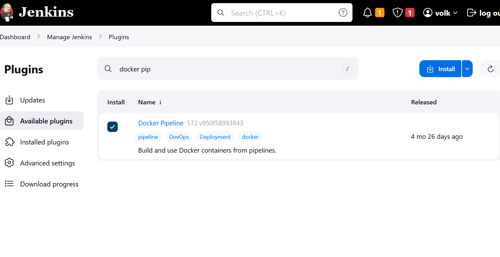
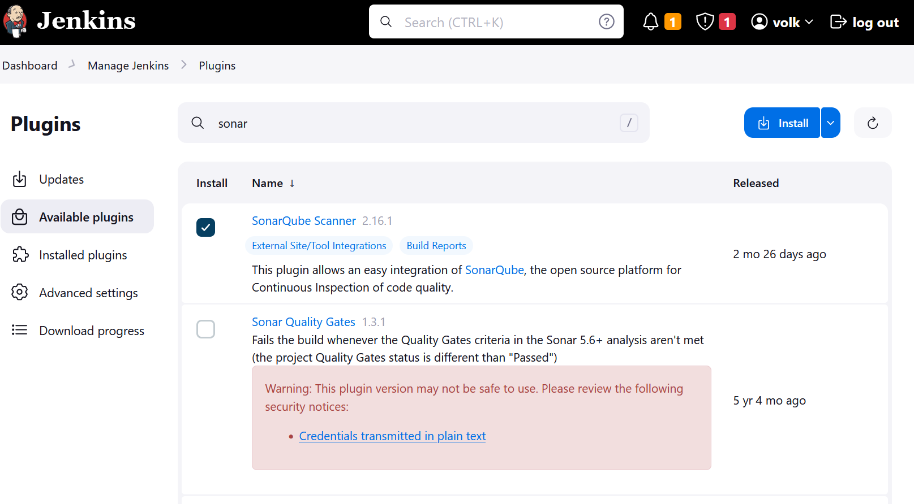
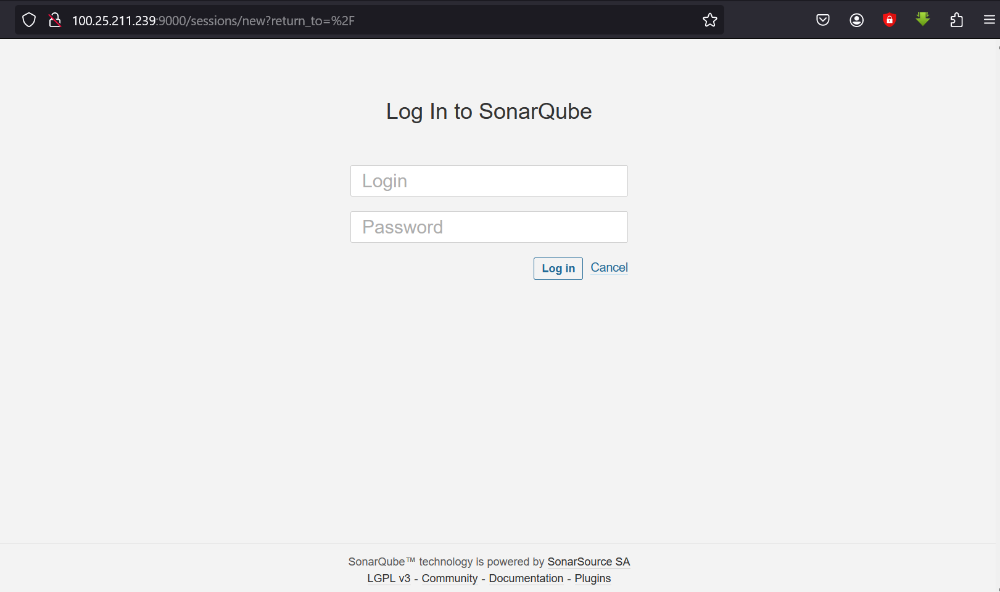
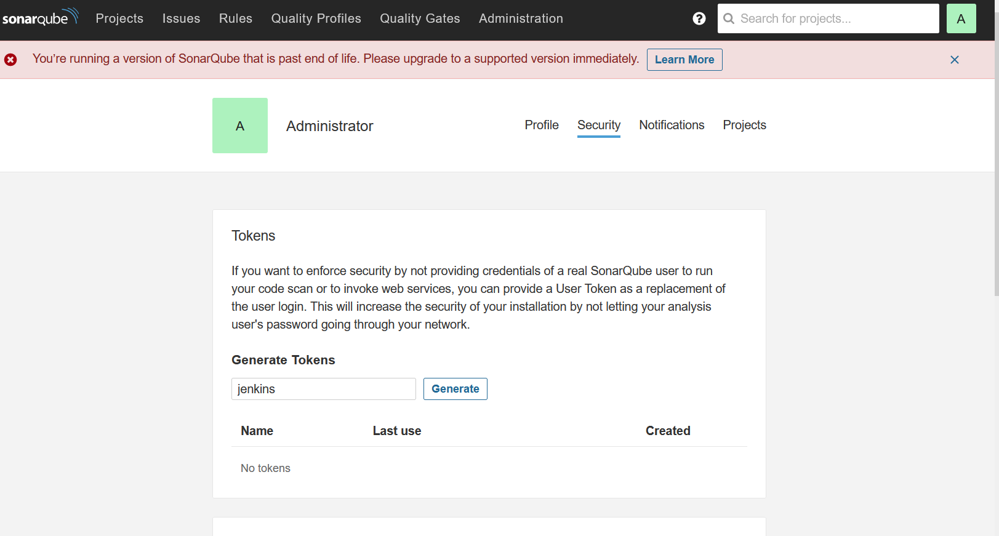
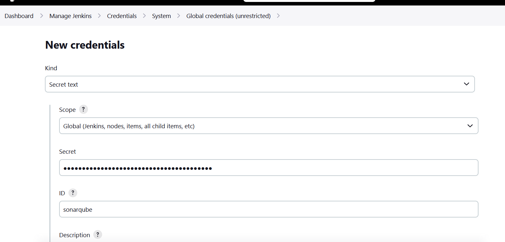
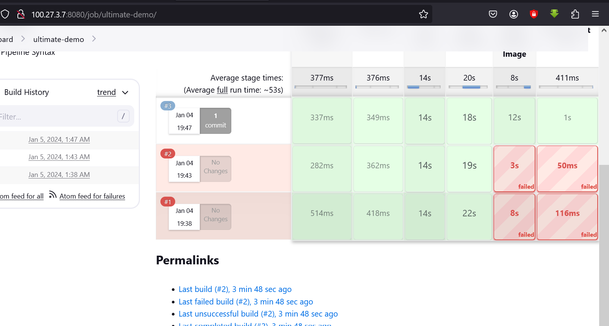
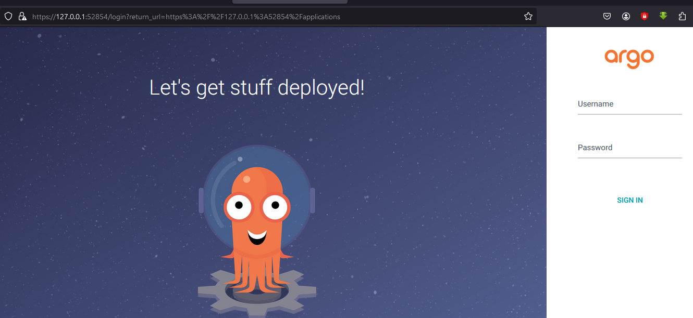
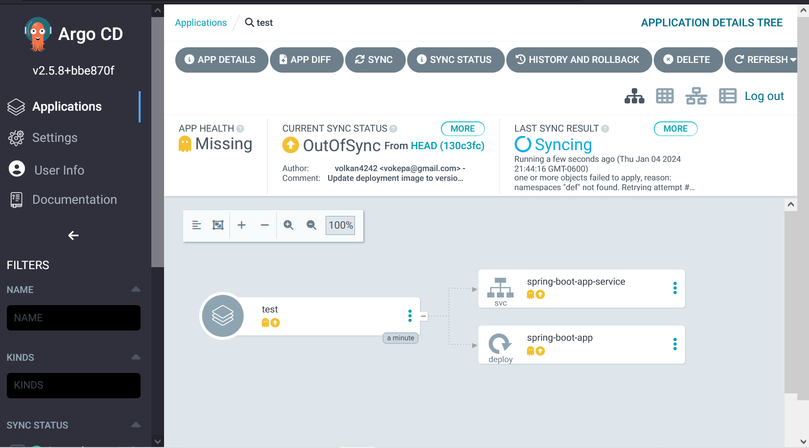
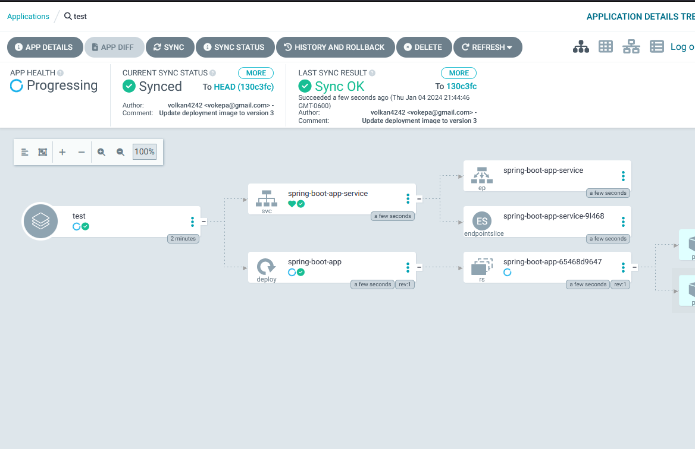

# Jenkins Pipeline for Java based application using Maven, SonarQube, Argo CD, Helm and Kubernetes

Here are the step-by-step details to set up an end-to-end Jenkins pipeline for a Java application using SonarQube, Argo CD, Helm, and Kubernetes:

Prerequisites:

- Java application code hosted on a Git repository
- Jenkins server
- Kubernetes cluster
- Helm package manager
- Argo CD

Steps:

** 1. Install the necessary Jenkins plugins:**
1.1 Git plugin
1.2 Maven Integration plugin

      

     **  1.3 Configure a Sonar Server locally**

         apt install unzip
         adduser sonarqube
         wget https://binaries.sonarsource.com/Distribution/sonarqube/sonarqube-9.4.0.54424.zip
         unzip *
         chmod -R 755 /home/sonarqube/sonarqube-9.4.0.54424
         chown -R sonarqube:sonarqube /home/sonarqube/sonarqube-9.4.0.54424
         cd sonarqube-9.4.0.54424/bin/linux-x86-64/
         ./sonar.sh start

       **1.4 Add sonartoken to jenkins credentials**

      **1.5 Docker Slave Configuration**

         Run the below command to Install Docker

         sudo apt update
         sudo apt install docker.io

         Grant Jenkins user and Ubuntu user permission to docker deamon.

         sudo su -
         usermod -aG docker jenkins
         usermod -aG docker ubuntu
         systemctl restart docker

    2. Create a new Jenkins pipeline:
       2.1 In Jenkins, create a new pipeline job and configure it with the Git repository URL for the Java application.
       2.2 Add a Jenkinsfile to the Git repository to define the pipeline stages.

    3. Define the pipeline stages:
        Stage 1: Checkout the source code from Git.
        Stage 2: Build the Java application using Maven.
        Stage 3: Run unit tests using JUnit and Mockito.
        Stage 4: Run SonarQube analysis to check the code quality.
        Stage 5: Package the application into a JAR file.
        Stage 6: Deploy the application to a test environment using Helm.
        Stage 7: Run user acceptance tests on the deployed application.
        Stage 8: Promote the application to a production environment using Argo CD.

    4. Configure Jenkins pipeline stages:
        Stage 1: Use the Git plugin to check out the source code from the Git repository.
        Stage 2: Use the Maven Integration plugin to build the Java application.
        Stage 3: Use the JUnit and Mockito plugins to run unit tests.
        Stage 4: Use the SonarQube plugin to analyze the code quality of the Java application.
        Stage 5: Use the Maven Integration plugin to package the application into a JAR file.
        Stage 6: Use the Kubernetes Continuous Deploy plugin to deploy the application to a test environment using Helm.
        Stage 7: Use a testing framework like Selenium to run user acceptance tests on the deployed application.
        Stage 8: Use Argo CD to promote the application to a production environment.

    5. Set up Argo CD:
        Install Argo CD on the Kubernetes cluster.

        Set up a Git repository for Argo CD to track the changes in the Helm charts and Kubernetes manifests.
        Create a Helm chart for the Java application that includes the Kubernetes manifests and Helm values.
        Add the Helm chart to the Git repository that Argo CD is tracking.

    6. Configure Jenkins pipeline to integrate with Argo CD:
       6.1 Add the Argo CD API token to Jenkins credentials.
       6.2 Update the Jenkins pipeline to include the Argo CD deployment stage.

    7. Run the Jenkins pipeline:
       7.1 Trigger the Jenkins pipeline to start the CI/CD process for the Java application.
       7.2 Monitor the pipeline stages and fix any issues that arise.

This end-to-end Jenkins pipeline will automate the entire CI/CD process for a Java application, from code checkout to production deployment, using popular tools like SonarQube, Argo CD, Helm, and Kubernetes.
