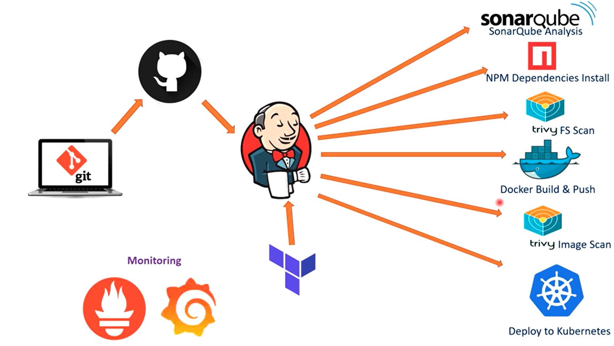
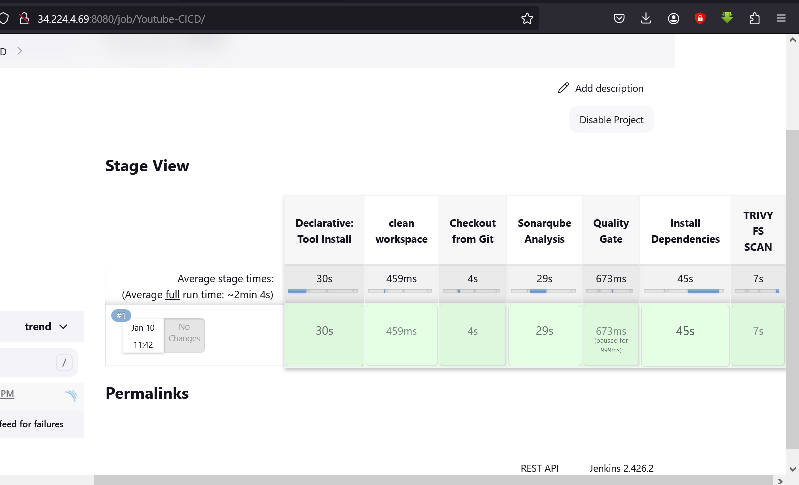
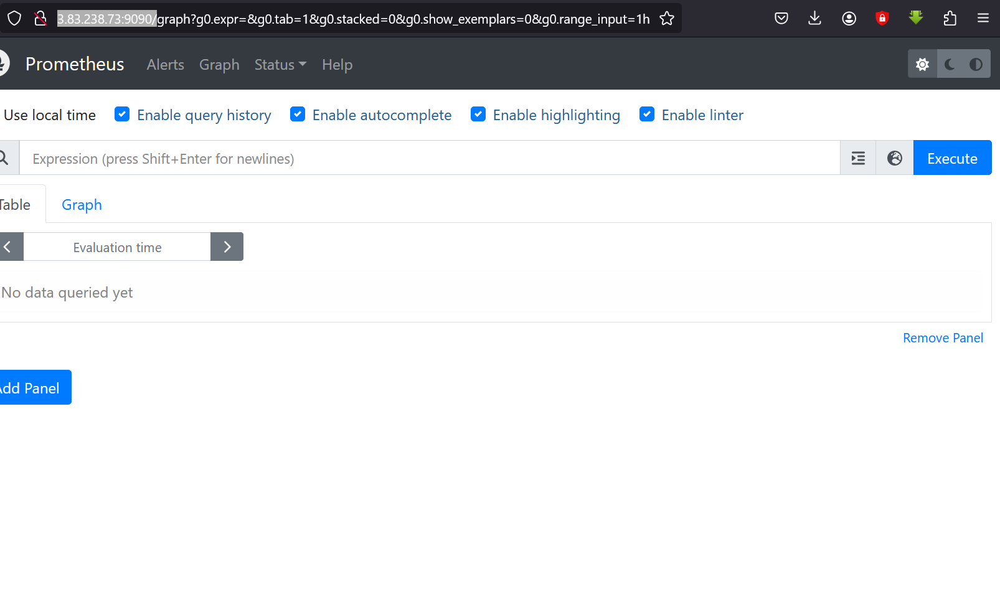
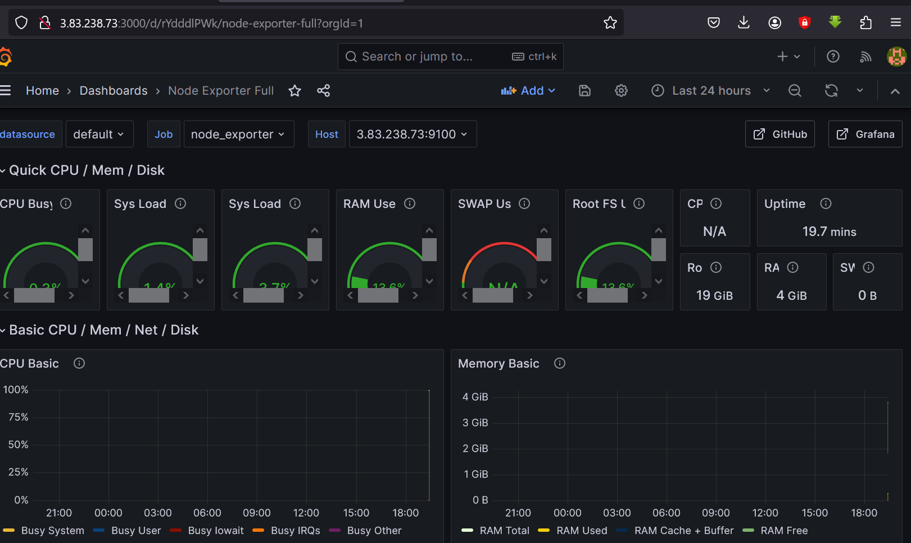
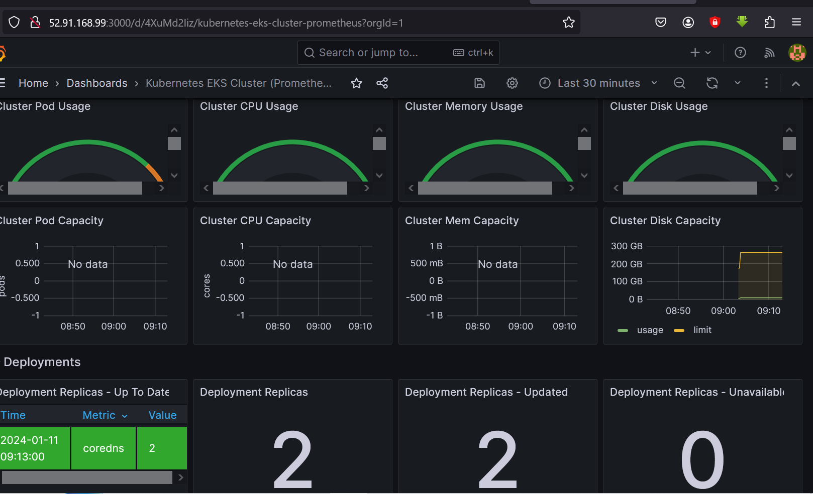
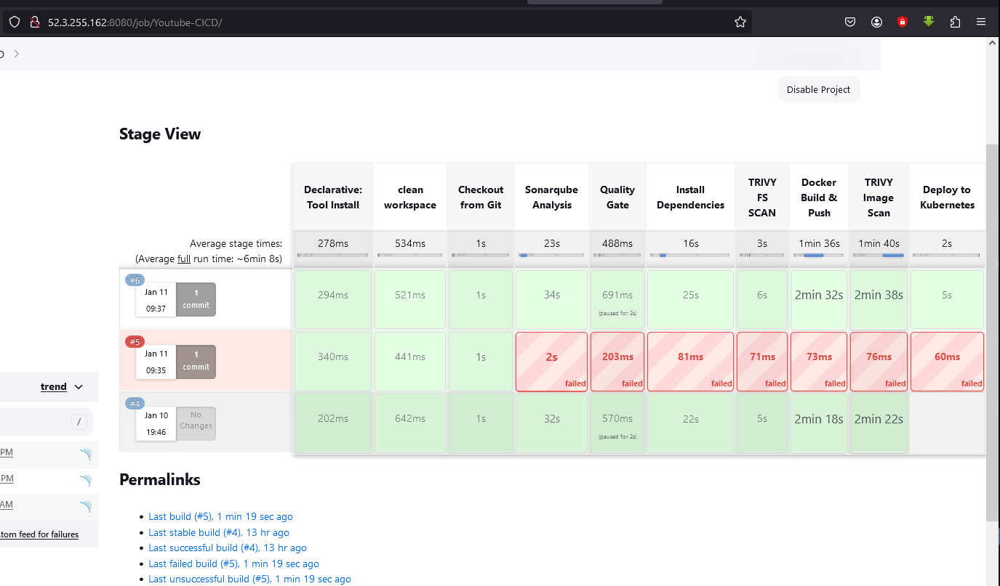
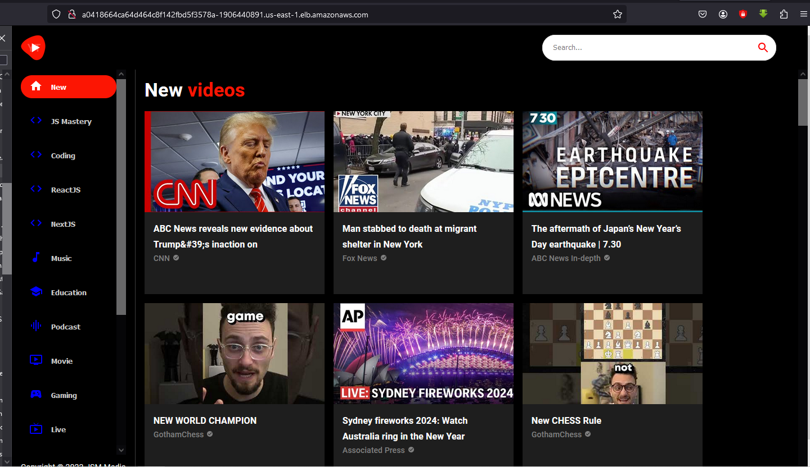

# Project-019: Build and Deploy a Modern YouTube Clone Application

[_Project Source_](https://www.youtube.com/watch?v=TY6hW7fecuI)

## Pre-requisities:

- AWS Account
- GitHub account
- Jenkins
- Nexus
- SonarQube



### Step-1: Instaling Jenkins ,SonarQube and Trivy Server from Terraform

**Main.tf**

```sh
resource "aws_instance" "web" {
ami = "ami-06aa3f7caf3a30282" #change ami id for different region
instance_type = "t2.large"
key_name = "my_key" #change key name as per your setup
vpc_security_group_ids = [aws_security_group.Jenkins-VM-SG.id]
user_data = templatefile("./install.sh", {})

tags = {
Name = "Jenkins-SonarQube"
}

root_block_device {
volume_size = 40
}
}

resource "aws_security_group" "Jenkins-VM-SG" {
name = "Jenkins-VM-SG"
description = "Allow TLS inbound traffic"

ingress = [
for port in [22, 80, 443, 8080, 9000, 3000] : {
description = "inbound rules"
from_port = port
to_port = port
protocol = "tcp"
cidr_blocks = ["0.0.0.0/0"]
ipv6_cidr_blocks = []
prefix_list_ids = []
security_groups = []
self = false
}
]

egress {
from_port = 0
to_port = 0
protocol = "-1"
cidr_blocks = ["0.0.0.0/0"]
}

tags = {
Name = "Jenkins-VM-SG"
}
}
```

**Provider.tf**

```sh
terraform {
required_providers {
aws = {
source = "hashicorp/aws"
version = "~> 5.0"
}
}
}

# Configure the AWS Provider

provider "aws" {
region = "us-east-1" #change region as per you requirement

}
```

**Install.sh**

```sh
#!/bin/bash
sudo apt update -y
wget -O - https://packages.adoptium.net/artifactory/api/gpg/key/public | tee /etc/apt/keyrings/adoptium.asc
echo "deb [signed-by=/etc/apt/keyrings/adoptium.asc] https://packages.adoptium.net/artifactory/deb $(awk -F= '/^VERSION_CODENAME/{print$2}' /etc/os-release) main" | tee /etc/apt/sources.list.d/adoptium.list
sudo apt update -y
sudo apt install temurin-17-jdk -y
/usr/bin/java --version
curl -fsSL https://pkg.jenkins.io/debian-stable/jenkins.io-2023.key | sudo tee /usr/share/keyrings/jenkins-keyring.asc > /dev/null
echo deb [signed-by=/usr/share/keyrings/jenkins-keyring.asc] https://pkg.jenkins.io/debian-stable binary/ | sudo tee /etc/apt/sources.list.d/jenkins.list > /dev/null
sudo apt-get update -y
sudo apt-get install jenkins -y
sudo systemctl start jenkins
sudo systemctl status jenkins

##Install Docker and Run SonarQube as Container
sudo apt-get update
sudo apt-get install docker.io -y
sudo usermod -aG docker ubuntu
sudo usermod -aG docker jenkins
newgrp docker
sudo chmod 777 /var/run/docker.sock
docker run -d --name sonar -p 9000:9000 sonarqube:lts-community

#install trivy
sudo apt-get install wget apt-transport-https gnupg lsb-release -y
wget -qO - https://aquasecurity.github.io/trivy-repo/deb/public.key | gpg --dearmor | sudo tee /usr/share/keyrings/trivy.gpg > /dev/null
echo "deb [signed-by=/usr/share/keyrings/trivy.gpg] https://aquasecurity.github.io/trivy-repo/deb $(lsb_release -sc) main" | sudo tee -a /etc/apt/sources.list.d/trivy.list
sudo apt-get update
sudo apt-get install trivy -y
```

### Step-2: Configure Jenkins plugin

- We will install below plugins for Jenkins.

```sh
Maven Integration
Github Integration
Eclipse
SonarQube Scanner
Sonar Quality Gates
Nodejs
Docker
Docker Commons
Docker-build-step
Docker Api

```

- Next we need to add Sonarqube credentials to Jenkins. Go to `Manage Jenkins` -> `Manage Credentials` -> `Global` -> `Add Credentials`

We are going to add our Sonarqube credentials to jenkins. Then we are going to create quality gates webhook from sonarquabe.

### Step-3: Create Jenkins pipeline to build and push to Docker images

We are going to create pipeline scrip to build and push to Docker images.

```sh
pipeline {
    agent any
    tools {
        jdk 'jdk17'
        nodejs 'node16'
    }
    environment {
        SCANNER_HOME = tool 'sonar-scanner'
    }
    stages {
        stage('clean workspace') {
            steps {
                cleanWs()
            }
        }
        stage('Checkout from Git') {
            steps {
                git branch: 'main', url: 'https://github.com/Ashfaque-9x/a-youtube-clone-app.git'
            }
        }
        stage("Sonarqube Analysis") {
            steps {
                withSonarQubeEnv('SonarQube-Server') {
                    sh '''$SCANNER_HOME/bin/sonar-scanner -Dsonar.projectName=Youtube-CICD \
                    -Dsonar.projectKey=Youtube-CICD'''
                }
            }
        }
        stage("Quality Gate") {
            steps {
                script {
                    waitForQualityGate abortPipeline: false, credentialsId: 'SonarQube-Token'
                }
            }
        }
        stage('Install Dependencies') {
            steps {
                sh "npm install"
            }
        }
        stage('TRIVY FS SCAN') {
             steps {
                 sh "trivy fs . > trivyfs.txt"
             }
         }
         stage("Docker Build & Push"){
             steps{
                 script{
                   withDockerRegistry(credentialsId: 'dockerhub', toolName: 'docker'){
                      sh "docker build -t youtube-clone ."
                      sh "docker tag youtube-clone ashfaque9x/youtube-clone:latest "
                      sh "docker push ashfaque9x/youtube-clone:latest "
                    }
                }
            }
        }
        stage("TRIVY Image Scan"){
            steps{
                sh "trivy image ashfaque9x/youtube-clone:latest > trivyimage.txt"
```



### Step-4: Cretae EC2 Instance and Setup Promethus and Grafana

We are going to create promethus and grafana server from terraform file.

```sh
resource "aws_instance" "web" {
  ami                    = "ami-06aa3f7caf3a30282"      #change ami id for different region
  instance_type          = "t2.medium"
  key_name               = "my_key"              #change key name as per your setup
  vpc_security_group_ids = [aws_security_group.Monitoring-Server-SG.id]
  user_data              = templatefile("./install.sh", {})

  tags = {
    Name = "Monitoring-Server"
  }

  root_block_device {
    volume_size = 20
  }
}

resource "aws_security_group" "Monitoring-Server-SG" {
  name        = "Monitoring-Server-SG"
  description = "Allow TLS inbound traffic"

  ingress = [
    for port in [22, 80, 443, 9090, 9100, 3000] : {
      description      = "inbound rules"
      from_port        = port
      to_port          = port
      protocol         = "tcp"
      cidr_blocks      = ["0.0.0.0/0"]
      ipv6_cidr_blocks = []
      prefix_list_ids  = []
      security_groups  = []
      self             = false
    }
  ]

  egress {
    from_port   = 0
    to_port     = 0
    protocol    = "-1"
    cidr_blocks = ["0.0.0.0/0"]
  }

  tags = {
    Name = "Monitoring-Server-SG"
  }
}

```

**Provider.tf**

terraform {
required_providers {
aws = {
source = "hashicorp/aws"
version = "~> 5.0"
}
}
}

# Configure the AWS Provider

provider "aws" {
region = "us-east-1" #change region as per you requirement
}

**install.sh**

```sh
#!/bin/bash
sudo apt update -y

##Install Prometheus and Create Service for Prometheus
sudo useradd --system --no-create-home --shell /bin/false prometheus
wget https://github.com/prometheus/prometheus/releases/download/v2.47.1/prometheus-2.47.1.linux-amd64.tar.gz
tar -xvf prometheus-2.47.1.linux-amd64.tar.gz
cd prometheus-2.47.1.linux-amd64/
sudo mkdir -p /data /etc/prometheus
sudo mv prometheus promtool /usr/local/bin/
sudo mv consoles/ console_libraries/ /etc/prometheus/
sudo mv prometheus.yml /etc/prometheus/prometheus.yml
sudo chown -R prometheus:prometheus /etc/prometheus/ /data/
sudo cat > /etc/systemd/system/prometheus.service << EOF
[Unit]
Description=Prometheus
Wants=network-online.target
After=network-online.target

StartLimitIntervalSec=500
StartLimitBurst=5

[Service]
User=prometheus
Group=prometheus
Type=simple
Restart=on-failure
RestartSec=5s
ExecStart=/usr/local/bin/prometheus \
  --config.file=/etc/prometheus/prometheus.yml \
  --storage.tsdb.path=/data \
  --web.console.templates=/etc/prometheus/consoles \
  --web.console.libraries=/etc/prometheus/console_libraries \
  --web.listen-address=0.0.0.0:9090 \
  --web.enable-lifecycle

[Install]
WantedBy=multi-user.target
EOF
sudo systemctl enable prometheus
sudo systemctl start prometheus

##Install Node Exporter and Create Service for Node Exporter
sudo useradd --system --no-create-home --shell /bin/false node_exporter
wget https://github.com/prometheus/node_exporter/releases/download/v1.6.1/node_exporter-1.6.1.linux-amd64.tar.gz
tar -xvf node_exporter-1.6.1.linux-amd64.tar.gz
sudo mv node_exporter-1.6.1.linux-amd64/node_exporter /usr/local/bin/
rm -rf node_exporter*
sudo cat > /etc/systemd/system/node_exporter.service << EOF
[Unit]
Description=Node Exporter
Wants=network-online.target
After=network-online.target

StartLimitIntervalSec=500
StartLimitBurst=5

[Service]
User=node_exporter
Group=node_exporter
Type=simple
Restart=on-failure
RestartSec=5s
ExecStart=/usr/local/bin/node_exporter --collector.logind

[Install]
WantedBy=multi-user.target
EOF
sudo systemctl enable node_exporter
sudo systemctl start node_exporter

##Install Grafana
$ sudo apt-get update
$ sudo apt-get install -y apt-transport-https software-properties-common
$ wget -q -O - https://packages.grafana.com/gpg.key | sudo apt-key add -
$ echo "deb https://packages.grafana.com/oss/deb stable main" | sudo tee -a /etc/apt/sources.list.d/grafana.list
$ sudo apt-get update
$ sudo apt-get -y install grafana
$ sudo systemctl enable grafana-server
$ sudo systemctl start grafana-server
```

- We will create Jenkinsfile for Build pipeline as below. The variables mentioned in pom.xml repository part and settings.xml will be declared in Jenkinsfile with their values to be used during execution. Update Pipeline file and push to GitHub.

```sh
pipeline {
    agent any
    tools {
        maven "MAVEN3"
        jdk "OracleJDK8"
    }

    environment {
        SNAP_REPO = 'vprofile-snapshot'
        NEXUS_USER = 'admin'
        NEXUS_PASS = '1234567890'
        RELEASE_REPO = 'vprofile-release'
        CENTRAL_REPO = 'vpro-maven-central'
        NEXUSIP = '172.31.10.138'
        NEXUSPORT = '8081'
        NEXUS_GRP_REPO = 'vpro-maven-group'
        NEXUS_LOGIN = 'nexuslogin'
    }

    stages {
        stage('Build') {
            steps {
                sh 'mvn -s settings.xml -DskipTests install'
            }
        }
    }
}
```

Add job for node exporter in prometheus
$ cd /etc/prometheus/, ls, $ sudo nano prometheus.yml and below the job of prometheus, add job for node exporter

- job_name: 'node_exporter'
  static_configs:
  - targets: ['IP-Address:9100']

6--Check the indentatio of the prometheus config file with below command
$ promtool check config /etc/prometheus/prometheus.yml

7--Reload the Prometheus configuration
$ curl -X POST http://localhost:9090/-/reload

8--On monitoring server go to $ cd /etc/prometheus/ & $ sudo nano prometheus.yml and add job for Jenkins

- job_name: 'jenkins'
  metrics_path: '/prometheus'
  static_configs: - targets: ['IP-Address:8080']





### Step-05: Creatin AWS Eks Cluster

1--Install kubectl on Jenkins Server

```sh
 sudo apt update
 sudo apt install curl
 curl -LO https://dl.k8s.io/release/$(curl -L -s https://dl.k8s.io/release/stable.txt)/bin/linux/amd64/kubectl
 sudo install -o root -g root -m 0755 kubectl /usr/local/bin/kubectl
 kubectl version --client
```

2--Install AWS Cli

```sh
curl "https://awscli.amazonaws.com/awscli-exe-linux-x86_64.zip" -o "awscliv2.zip"
sudo apt install unzip
unzip awscliv2.zip
sudo ./aws/install
aws --version
```

3--Installing eksctl

```sh
curl --silent --location "https://github.com/weaveworks/eksctl/releases/latest/download/eksctl_$(uname -s)_amd64.tar.gz" | tar xz -C /tmp
cd /tmp
sudo mv /tmp/eksctl /bin
eksctl version
```

4--Setup Kubernetes using eksctl

```sh
eksctl create cluster --name virtualtechbox-cluster \
--region ap-south-1 \
--node-type t2.small \
--nodes 3 \
```

5--Verify Cluster with below command

```sh
kubectl get nodes
```

### Step-06: Integrate Prometheus with EKS and Import Grafana Monitoring Dashboard for Kubernetes

1--Install Helm

```sh
sudo snap install helm --classic,    $ helm version
                    OR
curl -fsSL -o get_helm.sh https://raw.githubusercontent.com/helm/helm/master/scripts/get-helm-3
chmod 700 get_helm.sh
./get_helm.sh
helm version
```

2--Install Prometheus on EKS

```sh
helm repo add stable https://charts.helm.sh/stable          ///We need to add the Helm Stable Charts for our local client

helm repo add prometheus-community https://prometheus-community.github.io/helm-charts     ///Add Prometheus Helm repo

kubectl create namespace prometheus            ///Create Prometheus namespace

helm install stable prometheus-community/kube-prometheus-stack -n prometheus      ///Install Prometheus

kubectl get pods -n prometheus          ///To check whether Prometheus is installed

 kubectl get svc -n prometheus           ///to check the services file (svc) of the Prometheus
```

##let’s expose Prometheus to the external world using LoadBalancer

```sh
kubectl edit svc stable-kube-prometheus-sta-prometheus -n prometheus    ///type:LoadBalancer, change port & targetport to 9090, save and close

kubectl get svc -n prometheus    //copy dns name of LB and browse with 9090
```




### Step-07:Set the Trigger and Verify the CI/CD Pipeline

```sh
git config --global user.name "your.name"
git config --global user.email "your-email-address"
git clone https://github.com/Ashfaque-9x/a-youtube-clone-app.git
cd a-youtube-clone-app
git add .
git commit -m "test change"
git push origin main
```

### Step-08 Complete jenkins pipeline script

```sh
pipeline {
    agent any
    tools {
        jdk 'jdk17'
        nodejs 'node16'
    }
    environment {
        SCANNER_HOME = tool 'sonar-scanner'
    }
    stages {
        stage('clean workspace') {
            steps {
                cleanWs()
            }
        }
        stage('Checkout from Git') {
            steps {
                git branch: 'main', url: 'https://github.com/Ashfaque-9x/a-youtube-clone-app.git'
            }
        }
        stage("Sonarqube Analysis") {
            steps {
                withSonarQubeEnv('SonarQube-Server') {
                    sh '''$SCANNER_HOME/bin/sonar-scanner -Dsonar.projectName=Youtube-CICD \
                    -Dsonar.projectKey=Youtube-CICD'''
                }
            }
        }
        stage("Quality Gate") {
            steps {
                script {
                    waitForQualityGate abortPipeline: false, credentialsId: 'SonarQube-Token'
                }
            }
        }
        stage('Install Dependencies') {
            steps {
                sh "npm install"
            }
        }
        stage('TRIVY FS SCAN') {
             steps {
                 sh "trivy fs . > trivyfs.txt"
             }
         }
         stage("Docker Build & Push"){
             steps{
                 script{
                   withDockerRegistry(credentialsId: 'dockerhub', toolName: 'docker'){
                      sh "docker build -t youtube-clone ."
                      sh "docker tag youtube-clone ashfaque9x/youtube-clone:latest "
                      sh "docker push ashfaque9x/youtube-clone:latest "
                    }
                }
            }
        }
        stage("TRIVY Image Scan"){
            steps{
                sh "trivy image ashfaque9x/youtube-clone:latest > trivyimage.txt"
            }
        }
        stage('Deploy to Kubernets'){
            steps{
                script{
                    dir('Kubernetes') {
                      withKubeConfig(caCertificate: '', clusterName: '', contextName: '', credentialsId: 'kubernetes', namespace: '', restrictKubeConfigAccess: false, serverUrl: '') {
                      sh 'kubectl delete --all pods'
                      sh 'kubectl apply -f deployment.yml'
                      sh 'kubectl apply -f service.yml'
                      }
                    }
                }
            }
        }
    }
    post {
     always {
        emailext attachLog: true,
            subject: "'${currentBuild.result}'",
            body: "Project: ${env.JOB_NAME}<br/>" +
                "Build Number: ${env.BUILD_NUMBER}<br/>" +
                "URL: ${env.BUILD_URL}<br/>",
            to: 'ashfaque.s510@gmail.com',
            attachmentsPattern: 'trivyfs.txt,trivyimage.txt'
        }
    }
}
```





### Step-08 Cleanup

```sh
kubectl delete --all pods -n prometheus                   //This command will delete all the pods in prometheus namespace
kubectl delete namespace prometheus
kubectl get all                                           //This command will show the all the deployments, pods & services in default namespace
kubectl delete deployment.apps/virtualtechbox-cluster     //delete deployment in your k8s cluster
kubectl delete service/virtualtechbox-service             //delete service for your deployment of k8s cluster
eksctl delete cluster virtualtechbox-cluster --region ap-south-1     OR    eksctl delete cluster --region=ap-south-1 --name=virtualtechbox-cluster      //This command will delete your EKS cluster
terraform destroy
```
