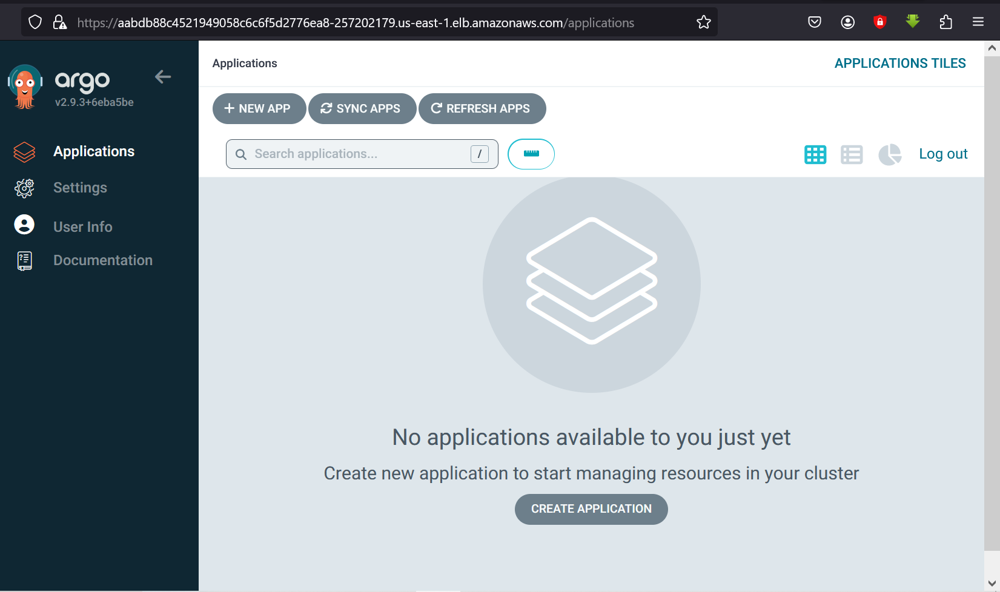

# Project-030: DevOps-Project-with-Jenkins-Maven-SonaQube-Docker-and-EKS

[_Project Source_](https://www.youtube.com/watch?v=e42hIYkvxoQ)


### Step-1: Install and Configure the Jenkins-Master & Jenkins-Agent

We will launch an Ec2 to install jenkins with below properties.

```sh
Name: jenkins-server
AMI: Ubuntu 20.04
InstanceType: t2.micro
SecGrp: allow SSH on port 22 from MyIP
KeyPair: create a new keypair
```

## Install Java

```sh
sudo apt update
sudo apt upgrade
sudo nano /etc/hostname
sudo init 6
sudo apt install openjdk-17-jre
java -version
```

## Install Jenkins

```sh
curl -fsSL https://pkg.jenkins.io/debian/jenkins.io-2023.key | sudo tee \
  /usr/share/keyrings/jenkins-keyring.asc > /dev/null
echo deb [signed-by=/usr/share/keyrings/jenkins-keyring.asc] \
  https://pkg.jenkins.io/debian binary/ | sudo tee \
  /etc/apt/sources.list.d/jenkins.list > /dev/null
sudo apt-get update
sudo apt-get install jenkins
```

```sh
sudo systemctl enable jenkins       //Enable the Jenkins service to start at boot
sudo systemctl start jenkins        //Start Jenkins as a service
systemctl status jenkins

```

## Install Jenkins Plugins

We will install maven, maven integration,pipeline maven,eclipse, plugins from jenkins plugins.

then we will manage maven from tools in the jenkins.

### Step-2: Create Pipeline Script for build & Test Artifact and Create CI Job on Jenkins

We will create jenkins file for the test our application.

```sh
pipeline {
    agent { label 'jenkins-agent' }
    tools {
        jdk 'Java17'
        maven 'Maven3'
    }
    stages {
        stage("Cleanup Workspace") {
            steps {
                cleanWs()
            }
        }
        stage("Checkout from SCM") {
            steps {
                git branch: 'main', credentialsId: 'github', url: 'https://github.com/volkan4242/register-app'
            }
        }
        stage("Build Application") {
            steps {
                sh "mvn clean package"
            }
        }
        stage("Test Application") {
            steps {
                sh "mvn test"
            }
        }
    }
}
```


### Step-3: Install and Configure the SonarQub

We will launch an Ec2 to install Sonarqubewith below properties.

```sh
Name: sonarqube
AMI: Ubuntu 20.04
InstanceType: t3.medium
SecGrp: allow SSH on port 22 from MyIP
KeyPair: create a new keypair
```

## Update Package Repository and Upgrade Packages

    ```sh
     sudo apt update
     sudo apt upgrade
    ```

## Add PostgresSQL repository

     ```sh
     sudo sh -c 'echo "deb http://apt.postgresql.org/pub/repos/apt $(lsb_release -cs)-pgdg main" > /etc/apt/sources.list.d/pgdg.list'
     wget -qO- https://www.postgresql.org/media/keys/ACCC4CF8.asc | sudo tee /etc/apt/trusted.gpg.d/pgdg.asc &>/dev/null
     ```

## Install PostgreSQL

     ```sh
     sudo apt update
     sudo apt-get -y install postgresql postgresql-contrib
     sudo systemctl enable postgresql
     ```

## Create Database for Sonarqube

     ```sh
     sudo passwd postgres
     su - postgres
    createuser sonar
    psql
     ALTER USER sonar WITH ENCRYPTED password 'sonar';
     CREATE DATABASE sonarqube OWNER sonar;
     grant all privileges on DATABASE sonarqube to sonar;
    \q
     exit
     ```

## Add Adoptium repository

     ```sh
     sudo bash
     wget -O - https://packages.adoptium.net/artifactory/api/gpg/key/public | tee /etc/apt/keyrings/adoptium.asc
     echo "deb [signed-by=/etc/apt/keyrings/adoptium.asc] https://packages.adoptium.net/artifactory/deb $(awk -F= '/^VERSION_CODENAME/{print$2}' /etc/os-release) main" | tee /etc/apt/sources.list.d/adoptium.list
     ```

## Install Java 17

    ```sh
    apt update
    apt install temurin-17-jdk
    update-alternatives --config java
    /usr/bin/java --version
    exit
    ```

## Linux Kernel Tuning

# Increase Limits

     sudo vim /etc/security/limits.conf
    //Paste the below values at the bottom of the file
    sonarqube   -   nofile   65536
    sonarqube   -   nproc    4096

    # Increase Mapped Memory Regions
    sudo vim /etc/sysctl.conf
    //Paste the below values at the bottom of the file
    vm.max_map_count = 262144

#### Sonarqube Installation

## Download and Extract

     ```sh
     sudo wget https://binaries.sonarsource.com/Distribution/sonarqube/sonarqube-9.9.0.65466.zip
     sudo apt install unzip
     sudo unzip sonarqube-9.9.0.65466.zip -d /opt
     sudo mv /opt/sonarqube-9.9.0.65466 /opt/sonarqube
     ```

## Create user and set permissions

      ```sh
      sudo groupadd sonar
      sudo useradd -c "user to run SonarQube" -d /opt/sonarqube -g sonar sonar
      sudo chown sonar:sonar /opt/sonarqube -R
      ```

## Update Sonarqube properties with DB credentials

      sudo vim /opt/sonarqube/conf/sonar.properties
     //Find and replace the below values, you might need to add the sonar.jdbc.url
     sonar.jdbc.username=sonar
     sonar.jdbc.password=sonar
     sonar.jdbc.url=jdbc:postgresql://localhost:5432/sonarqube

## Create service for Sonarqube

```sh
sudo vim /etc/systemd/system/sonar.service
```

//Paste the below into the file

     ```sh
     [Unit]
     Description=SonarQube service
     After=syslog.target network.target

     [Service]
     Type=forking

     ExecStart=/opt/sonarqube/bin/linux-x86-64/sonar.sh start
     ExecStop=/opt/sonarqube/bin/linux-x86-64/sonar.sh stop

     User=sonar
     Group=sonar
     Restart=always

     LimitNOFILE=65536
     LimitNPROC=4096

     [Install]
     WantedBy=multi-user.target
     ```

## Start Sonarqube and Enable service

      ```sh
      sudo systemctl start sonar
      sudo systemctl enable sonar
      sudo systemctl status sonar
      ```

## Watch log files and monitor for startup

      ```sh
      sudo tail -f /opt/sonarqube/logs/sonar.log
      ```

### Step-4: Integrate Sonarqube with Jenkins

- The Unit test/Code Coverage reports are generated under Jenkins workspace target directory. But these reports are not human readable. We need a tool which can scan and analyze the coed and present it in human readable format in a Dashboard. We will use SonarQube solution of this problem.
  Two things need to setup:

* SonarScanner tool in Jenkins to scan the code
* We need SonarQube information in jenkins so that Jenkins will know where to upload these reports

- Lets start with SonarScanner tool configuration. Go to `Manage Jenkins` -> `Global Tool Configuration`

```sh
Add sonar scanner
name: sonarscanner
tick install automatically
```

- Next we need to go to `Configure System`, and find ` SonarQube servers` section

```sh
tick environment variables
Add sonarqube
Name: sonarserver
Server URL: http://<private_ip_of_sonar_server>
Server authentication token: we need to create token from sonar website
```

- We will add our sonar token to global credentials.

```sh
Kind: secret text
Secret: <paste_token>
name: sonartoken
description: sonartoken
```

- We will add sonarQube code for our pipeline and commit/push changes to GitHub.


### Step-5: Build and Push Docker Image Using pipeline Script

We will install docker, docker common, docker pipeline and docker API from jenkins plugins.

Then we will add docher credentials to jenkins and add to jenkins pipeline this command;

```sh
environment {
	    APP_NAME = "register-app-pipeline"
            RELEASE = "1.0.0"
            DOCKER_USER = "ashfaque9x"
            DOCKER_PASS = 'dockerhub'
            IMAGE_NAME = "${DOCKER_USER}" + "/" + "${APP_NAME}"
            IMAGE_TAG = "${RELEASE}-${BUILD_NUMBER}"
	    JENKINS_API_TOKEN = credentials("JENKINS_API_TOKEN")

}


 stage("Build & Push Docker Image") {
            steps {
                script {
                    docker.withRegistry('',DOCKER_PASS) {
                        docker_image = docker.build "${IMAGE_NAME}"
                    }

                    docker.withRegistry('',DOCKER_PASS) {
                        docker_image.push("${IMAGE_TAG}")
                        docker_image.push('latest')
                    }

```


### Step-5: Trivy Scan

We will ad trivy scan part to our jenkins file.

```sh


 stage("Trivy Scan") {
           steps {
               script {
	            sh ('docker run -v /var/run/docker.sock:/var/run/docker.sock aquasec/trivy image ashfaque9x/register-app-pipeline:latest --no-progress --scanners vuln  --exit-code 0 --severity HIGH,CRITICAL --format table')
               }
           }
       }

       stage ('Cleanup Artifacts') {
           steps {
               script {
                    sh "docker rmi ${IMAGE_NAME}:${IMAGE_TAG}"
                    sh "docker rmi ${IMAGE_NAME}:latest"
               }
          }
       }

       stage("Trigger CD Pipeline") {
            steps {
                script {
                    sh "curl -v -k --user clouduser:${JENKINS_API_TOKEN} -X POST -H 'cache-control: no-cache' -H 'content-type: application/x-www-form-urlencoded' --data 'IMAGE_TAG=${IMAGE_TAG}' 'ec2-13-232-128-192.ap-south-1.compute.amazonaws.com:8080/job/gitops-register-app-cd/buildWithParameters?token=gitops-token'"
                }
            }
       }
    }
```

### Step-6: Setup Bootstrap Server for eksctl and Setup Kubernetes using eksctlr

## Install AWS Cli on the above EC2

```sh
Refer--https://docs.aws.amazon.com/cli/latest/userguide/getting-started-install.html
 sudo su
 curl "https://awscli.amazonaws.com/awscli-exe-linux-x86_64.zip" -o "awscliv2.zip"
 apt install unzip,   $ unzip awscliv2.zip
 sudo ./aws/install
```

         OR

```sh
sudo yum remove -y aws-cli
pip3 install --user awscli
sudo ln -s $HOME/.local/bin/aws /usr/bin/aws
aws --version
```

## Installing kubectl

```sh
sudo su
curl -O https://s3.us-west-2.amazonaws.com/amazon-eks/1.27.1/2023-04-19/bin/linux/amd64/kubectl
ll , $ chmod +x ./kubectl  //Gave executable permisions
mv kubectl /bin   //Because all our executable files are in /bin
kubectl version --output=yaml
```

## Installing eksctl

Refer---https://github.com/eksctl-io/eksctl/blob/main/README.md#installation

```sh
curl --silent --location "https://github.com/weaveworks/eksctl/releases/latest/download/eksctl_$(uname -s)_amd64.tar.gz" | tar xz -C /tmp
cd /tmp
ll
sudo mv /tmp/eksctl /bin
eksctl version
```

## Setup Kubernetes using eksctl

Refer--https://github.com/aws-samples/eks-workshop/issues/734

````sh
eksctl create cluster --name virtualtechbox-cluster \
--region us-east-1 \
--node-type t2.small \
--nodes 3 \
```\

```sh
kubectl get nodes
````

eksctl delete cluster virtualtechbox-cluster --region us-east-1


### Step-7:ArgoCD Installation on EKS Cluster and Add EKS Cluster to ArgoCD

1 ) First, create a namespace

```sh
 kubectl create namespace argocd
```

2 ) Next, let's apply the yaml configuration files for ArgoCd

```sh
kubectl apply -n argocd -f https://raw.githubusercontent.com/argoproj/argo-cd/stable/manifests/install.yaml
```

3 ) Now we can view the pods created in the ArgoCD namespace.

```sh
kubectl get pods -n argocd
```

4 ) To interact with the API Server we need to deploy the CLI:

```sh
curl --silent --location -o /usr/local/bin/argocd https://github.com/argoproj/argo-cd/releases/download/v2.4.7/argocd-linux-amd64
chmod +x /usr/local/bin/argocd
```

5 ) Expose argocd-server

```sh
 kubectl patch svc argocd-server -n argocd -p '{"spec": {"type": "LoadBalancer"}}'
```

6 ) Wait about 2 minutes for the LoadBalancer creation

```sh
 kubectl get svc -n argocd
```

7 ) Get pasword and decode it.

```sh
kubectl get secret argocd-initial-admin-secret -n argocd -o yaml
echo WXVpLUg2LWxoWjRkSHFmSA== | base64 --decode
```

## Add EKS Cluster to ArgoCD

9 ) login to ArgoCD from CLI

```sh
argocd login a2255bb2bb33f438d9addf8840d294c5-785887595.ap-south-1.elb.amazonaws.com --username admin
```

10 )

```sh
argocd cluster list
```

11 ) Below command will show the EKS cluster

```sh
 kubectl config get-contexts
```

12 ) Add above EKS cluster to ArgoCD with below command

```sh
 argocd cluster add i-08b9d0ff0409f48e7@virtualtechbox-cluster.ap-south-1.eksctl.io --name virtualtechbox-eks-cluster
```




### Step-8: Configure Argocd and Deploy pods on EKS Cluster

In the argocd go to application and add new application;

```sh
Application name:register-app
Project Name: Default
Source : Copy your github repository
Cluster URL: Select you eks cluster url
Namespaces: Default
```


  


### Step-14: Cleanup

```sh
kubectl delete deployment.apps/virtualtechbox-regapp       //it will delete the deployment

 kubectl delete service/virtualtechbox-service              //it will delete the service

eksctl delete cluster virtualtechbox --region us-eat-1     OR    eksctl delete cluster 
--region=us-eat-1--name=virtualtechbox-cluster      //it will delete the EKS cluster
```